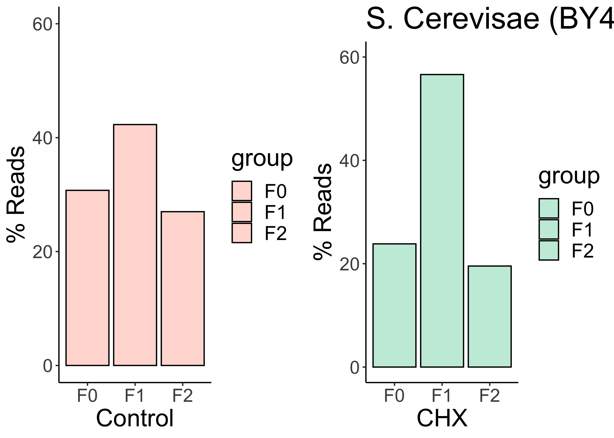
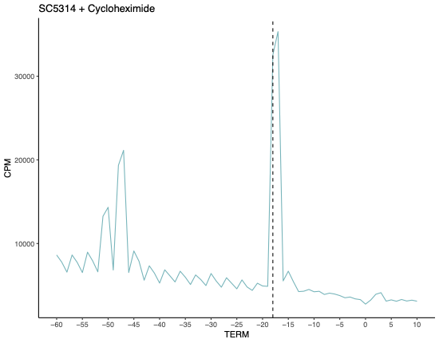
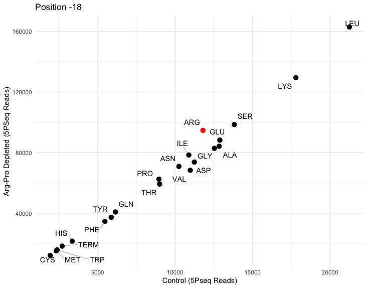

## Figure 1

Irene Stevens

23/05/2023

# This script will generate Figure 1: Compare S. Cerevisae (BY4741) and C. albicans (sc5314) ribosome dynamics

## Load libraries

``` r
library(ggplot2)
library(gridExtra)
library(tidyverse)
```

    ## ── Attaching core tidyverse packages ──────────────────────── tidyverse 2.0.0 ──
    ## ✔ dplyr     1.1.2     ✔ readr     2.1.4
    ## ✔ forcats   1.0.0     ✔ stringr   1.5.0
    ## ✔ lubridate 1.9.2     ✔ tibble    3.2.1
    ## ✔ purrr     1.0.2     ✔ tidyr     1.3.0
    ## ── Conflicts ────────────────────────────────────────── tidyverse_conflicts() ──
    ## ✖ dplyr::combine() masks gridExtra::combine()
    ## ✖ dplyr::filter()  masks stats::filter()
    ## ✖ dplyr::lag()     masks stats::lag()
    ## ℹ Use the conflicted package (<http://conflicted.r-lib.org/>) to force all conflicts to become errors

``` r
library(ggrepel)
```

## Figure 1A: Frame preferences in BY4741 versus SC5314.

Values represent the average of replicates from frame_stats.txt files
(see Data folder). For more details, see ‘Figure1’ R script notes in the
Figures folder.

# S. Cerevisae (BY4741) Control

Values represent the average of replicates of values from files:
y4741-ypd_ctr-r1_s1_frame_stats.txt, y4741-ypd_ctr-r2_s1_frame_stats.txt

``` r
data1 <- data.frame(frequency = c(30.75, 42.3, 27), group = c("F0", "F1", "F2"))
plot1 <- ggplot(data1, aes(x = group, y = frequency, fill = group)) +
    geom_bar(stat = "identity", color = "black") +
    scale_fill_manual(values = c("F0" = rgb(255, 221, 214, maxColorValue = 255), 
                                 "F1" = rgb(255, 221, 214, maxColorValue = 255), 
                                 "F2" = rgb(255, 221, 214, maxColorValue = 255))) +
    labs(x = "Control", y = "% Reads") +
    theme_classic() +
    ylim(0, 60)  # Set the same y-axis limits as plot1
plot1 <- plot1 + theme(text = element_text(size = 20), 
        axis.text = element_text(size = 15), 
        axis.title = element_text(size = 20), 
        plot.title = element_text(size = 25))
```

## S. Cerevisae (BY4741) Cycloheximide

Values represent the average of replicates of values from files:
by4741-chx_t05-r1_s1_frame_stats.txt,
by4741-chx_t05-r2_s1_frame_stats.txt

``` r
data2 <- data.frame(frequency = c(23.84, 56.61, 19.55), group = c("F0", "F1", "F2"))
plot2 <- ggplot(data2, aes(x = group, y = frequency, fill = group)) +
    geom_bar(stat = "identity", color = "black") +
    scale_fill_manual(values = c("F0" = rgb(199, 236, 220, maxColorValue = 255), 
                                 "F1" = rgb(199, 236, 220, maxColorValue = 255), 
                                 "F2" = rgb(199, 236, 220, maxColorValue = 255))) +
    labs(x = "CHX", y = "% Reads", title="S. Cerevisae (BY4741)") +
    theme_classic() +
    ylim(0, 60)  # Set the same y-axis limits as plot1
plot2 <- plot2 + theme(text = element_text(size = 20), 
        axis.text = element_text(size = 15), 
        axis.title = element_text(size = 20), 
        plot.title = element_text(size = 25))

# Combine the S. Cerevisae plots in a panel
grid.arrange(plot1, plot2, ncol = 2)
```

<!-- -->

## Candida albicans (sc5314) Control

Values represent the average of replicates of values from files
CTX1_S21_R1_001_frame_stats.txt, CTX3_S22_R1_001_frame_stats.txt

``` r
data3 <- data.frame(frequency = c(41.6, 34.2, 24.7), group = c("F0", "F1", "F2"))
plot3 <- ggplot(data3, aes(x = group, y = frequency, fill = group)) +
    geom_bar(stat = "identity", color = "black") +
    scale_fill_manual(values = c("F0" = rgb(255, 135, 111, maxColorValue = 255), 
                                 "F1" = rgb(255, 135, 111, maxColorValue = 255), 
                                 "F2" = rgb(255, 135, 111, maxColorValue = 255))) +
    labs(x = "Control", y = "% Reads", title= "C.albicans (SC5314)") +
    theme_classic() + ylim(0,60)
plot3 <- plot3 + theme(text = element_text(size = 20), 
        axis.text = element_text(size = 15), 
        axis.title = element_text(size = 20), 
        plot.title = element_text(size = 25))
```

## Candida albicans (sc5314) Cycloheximide

Values represent the average of replicates of values from files:
CHX1_S13_R1_001_frame_stats.txt, CHX3_S15_R1_001_frame_stats.txt

``` r
data4 <- data.frame(frequency = c(38.83, 33.92, 27.24), group = c("F0", "F1", "F2"))
plot4 <- ggplot(data4, aes(x = group, y = frequency, fill = group)) +
    geom_bar(stat = "identity", color = "black") +
    scale_fill_manual(values = c("F0" = rgb(77, 181, 188, maxColorValue = 255), 
                                 "F1" = rgb(77, 181, 188, maxColorValue = 255), 
                                 "F2" = rgb(77, 181, 188, maxColorValue = 255))) +
    labs(x = "CHX", y = "% Reads") +
    theme_classic() + ylim(0,60)
plot4 <- plot4 + theme(text = element_text(size = 20), 
        axis.text = element_text(size = 15), 
        axis.title = element_text(size = 20), 
        plot.title = element_text(size = 25))

#Combine the Candida plots in a panel
grid.arrange(plot3, plot4, ncol = 2)
```

<!-- -->

## Figure 1B: Metaplots of termination site in BY4741 versus SC5314.

Counts per Million (CPM) = raw read count / total reads x 10^6 Raw read
count files: see Data folder, meta_counts_TERM.txt files Total read
count information: see Data folder, data_summary.txt files
(NumOfMapPositions) The average of 3 biological replicates is plotted

## BY4741 Control

``` r
control <- read.table("/Users/vip/Documents/CUG_reprocessed/Figure 1/A./BY4741/BY4741_Control_-60to+10.txt", header = TRUE)
ggplot(control, aes(x = Position, y = Avg_replicates)) +
  geom_line(color = rgb(255,221,214, maxColorValue = 255)) +  
  geom_vline(xintercept = -17, linetype = "dashed", color = "black") +   
  labs(x = "TERM", y = "CPM", title ="BY4741 Control") +
  theme_classic() + 
  scale_x_continuous(breaks = seq(min(control$Position), max(control$Position), by = 5))
```

<!-- -->

## BY4741 Cycloheximide

``` r
cycloheximide <- read.table("/Users/vip/Documents/CUG_reprocessed/Figure 1/A./BY4741/BY4741_Cycloheximide_-60to+10.txt", header = TRUE)
ggplot(cycloheximide, aes(x = Position, y = average_replicates)) +
  geom_line(color = rgb(199,236,220, maxColorValue = 255)) +  
  geom_vline(xintercept = -17, linetype = "dashed", color = "black") +   
  labs(x = "TERM", y = "CPM", title ="BY4741 + Cycloheximide") +
  theme_classic() + 
  scale_x_continuous(breaks = seq(min(control$Position), max(control$Position), by = 5))
```

<!-- -->

## SC5314 Control

``` r
Candida_control <- read.table("/Users/vip/Documents/CUG_reprocessed/Figure 1/A./Candida_Control_-60to+10.txt", header = TRUE)
ggplot(Candida_control, aes(x = Position, y = sc5314_control_CPM)) +
  geom_line(color = rgb(255,135,111, maxColorValue = 255)) +  geom_vline(xintercept = -18, linetype = "dashed", color = "black")  +   labs(x = "TERM", y = "CPM", title ="SC5314 Control") +
  theme_classic() + 
  scale_x_continuous(breaks = seq(min(control$Position), max(control$Position), by = 5))
```

<!-- -->

## SC5314 Cycloheximide

``` r
Candida_cycloheximide <- read.table("/Users/vip/Documents/CUG_reprocessed/Figure 1/A./Candida_Cycloheximide_-60to+10.txt", header = TRUE)
ggplot(Candida_cycloheximide, aes(x = Position, y = sc5314_Cycloheximide)) +
  geom_line(color = rgb(77,181,188, maxColorValue = 255)) +  geom_vline(xintercept = -18, linetype = "dashed", color = "black")  +   labs(x = "TERM", y = "CPM", title ="SC5314 + Cycloheximide") +
  theme_classic()+ scale_x_continuous(breaks = seq(min(control$Position), max(control$Position), by = 5))
```

<!-- -->

## Figure 1C. Metaplot at TSS in SC53144 treated with Cycloheximide

Input file was calculated as follows: Counts per million = raw counts
(meta_counts_TERM.txt)/total reads (NumOfMapPositions from
data_summary.txt) x 10^6 Plotted are Average of Cycloheximide_r1_CPM,
Cycloheximide_r2_CPM cor Treatment group and Average of Control_r1_CPM,
Control_r3_CPM for Control group

``` r
tss_start <- read.table("/Users/vip/Documents/CUG_reprocessed/Figure 1/START_metaplot_Candida.txt", header = TRUE)
tss_start$Candida_Cycloheximide
```

    ##   [1]  596  655  624  616  678  643  698  637  639  657  673  716  690  775  805
    ##  [16]  770  757  779  758  792  822  769  817  846  771  873  876  937  995 1024
    ##  [31]  893  952  941 1023 1032 1159 1128 1123 1162 1193 1289 1296 1367 1363 1550
    ##  [46] 1436 1535 1518 1619 1519 1551 1537 1613 1757 1582 1853 1842 1775 1754 1731
    ##  [61] 1846 1915 1899 1903 1798 1882 1945 1961 2023 2056 2078 2070 2114 2033 1899
    ##  [76] 2057 1931 2268 2305 2143 2029 2175 2053 2124 2292 3440 4214 2043 2254 2357
    ##  [91] 1943 2162 2109 2150 1903 1755 1907 1718 1343 1654 3910 2012 1467 1484 2915
    ## [106] 1166 1427 1687 1365 1519 1561 1290 1409 1518 1300 1411 1580 1298 1405 1689
    ## [121] 1355 1513 1677 1363 1456 1665 1376 1445 1628 1336 1459 1634 1329 1431 1558
    ## [136] 1305 1376 1643 1311 1404 1606 1302 1495 1646 1280 1463 1569 1323 1410 1701
    ## [151] 1314 1464 1624 1296 1541 1664 1365 1462 1688 1432 1560 1711 1411 1601 1760
    ## [166] 1349 1574 1638 1392 1531 1754 1436 1710 1715 1486 1738 1782 1463 1657 1743
    ## [181] 1444 1655 1801 1430 1637 1771 1462 1701 1860 1535 1773 1783 1467 1674 1803
    ## [196] 1488 1800 1873 1536 1798

``` r
tss_start$Candida_Control
```

    ##   [1]  191  159  145  207  201  162  175  212  139  164  213  206  176  213  272
    ##  [16]  222  215  226  277  205  288  195  182  276  199  234  253  225  261  291
    ##  [31]  253  249  341  360  353  322  372  284  294  318  379  278  420  477  412
    ##  [46]  470  441  395  634  558  403  463  448  522  447  602  532  616  597  554
    ##  [61]  581  632  620  583  529  744  540  643  624  901  743  844  884  759  810
    ##  [76]  822  847 1050 1087  788  784  900  792  786  928 1332 1378  689  838  714
    ##  [91]  780  718  761 1035  577  569  831  531  343  533 1598  489  373  506  590
    ## [106]  327  424  458  365  470  518  356  467  430  358  461  427  405  396  510
    ## [121]  390  498  486  397  529  513  399  546  528  443  464  522  372  474  470
    ## [136]  421  468  529  391  469  562  408  531  552  480  613  577  415  510  646
    ## [151]  451  633  606  451  558  638  494  572  621  496  560  585  501  624  799
    ## [166]  521  593  626  446  714  673  475  682  763  520  803  800  543  614  668
    ## [181]  603  749  717  535  670  753  618  663  697  556  734  746  592  739  727
    ## [196]  585  811  792  662  762

``` r
ggplot(tss_start, aes(x = Position)) +
  geom_line(aes(y = Candida_Cycloheximide), color = rgb(77, 181, 188, maxColorValue = 255)) +
  geom_line(aes(y = Candida_Control), color = rgb(255, 135, 111, maxColorValue = 255)) +
  geom_vline(xintercept = -14, linetype = "dashed", color = "grey") +
  geom_vline(xintercept = 0, linetype = "dashed", color = "grey") +
  geom_vline(xintercept = +4, linetype = "dashed", color = "grey") +
  annotate("text", x = -14, y = max(tss_start$Candida_Cycloheximide), label = "-14", vjust = -1) +
  annotate("text", x = 0, y = max(tss_start$Candida_Cycloheximide), label = "0", vjust = -1) +
  annotate("text", x = 4, y = max(tss_start$Candida_Cycloheximide), label = "+4", vjust = -1) +
  labs(x = "TSS", y = "CPM")+
  theme_classic() 
```

<!-- -->

## Figure 1D. Fast Fourier Transform of SC5314 treated with Cycloheximide: see Candida_main.html report

\##Figure 1E. See Candida_codon_linecharts.html report

\##Figure 1F. Scatterplot of amino acid pauses in depleted versus
control conditions

Note: the values at -18 from amino_acid_pauses.txt

``` r
data <- read.table("/Users/vip/Documents/CUG_reprocessed/Figure 1/aa_counts_position-18.txt", header = TRUE, row.names = 1)

data_avg <- data %>%
  mutate(ProArgDepletion_avg = rowMeans(select(., starts_with("Pro.Arg.Depletion")), na.rm = TRUE),
         Control_avg = rowMeans(select(., starts_with("Control")), na.rm = TRUE))

ggplot(data_avg, aes(x = Control_avg, y = ProArgDepletion_avg, label = rownames(data_avg))) +
  geom_point(size = 3, color = ifelse(rownames(data_avg) == "ARG", "red", "black")) +
  geom_text_repel(
    box.padding = 0.5,
    point.padding = 0.5,
    segment.color = 'grey',
    segment.size = 0.5,
    aes(label = rownames(data_avg)),
    color = "black"
  ) +
  labs(title = "Position -18",
       x = "Control (5Pseq Reads)",
       y = "Arg-Pro Depleted (5PSeq Reads)") +
  theme_minimal()
```

<!-- -->

Note: the values at -12 from amino_acid_pauses.txt

``` r
data <- read.table("/Users/vip/Documents/CUG_reprocessed/Figure 1/aa_counts_position-12.txt", header = TRUE, row.names = 1)

data_avg <- data %>%
  mutate(ProArgDepletion_avg = rowMeans(select(., starts_with("Pro.Arg.Depletion")), na.rm = TRUE),
         Control_avg = rowMeans(select(., starts_with("Control")), na.rm = TRUE))

ggplot(data_avg, aes(x = Control_avg, y = ProArgDepletion_avg, label = rownames(data_avg))) +
  geom_point(size = 3, color = ifelse(rownames(data_avg) %in% c("ARG", "PRO"), "red", "black")) +
  geom_text_repel(
    box.padding = 0.5,
    point.padding = 0.5,
    segment.color = 'grey',
    segment.size = 0.5,
    aes(label = rownames(data_avg)),
    color = ifelse(rownames(data_avg) %in% c("ARG", "PRO"), "red", "black")
  ) +
  labs(title = "Position -12",
       x = "Control (5Pseq Reads)",
       y = "Arg-Pro Depleted (5PSeq Reads)") +
  theme_minimal()
```

    ## Warning: ggrepel: 4 unlabeled data points (too many overlaps). Consider
    ## increasing max.overlaps

<!-- -->
