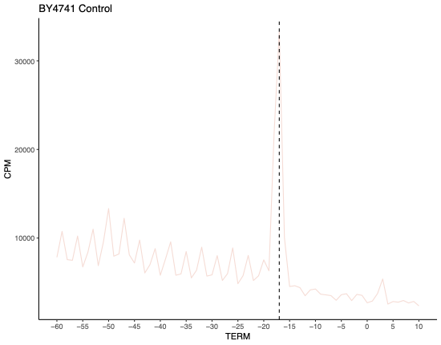
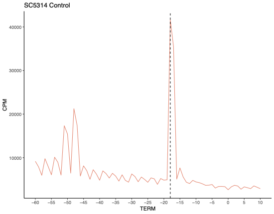

## Figure 3

Irene Stevens

23/05/2023

# This script will generate Figure 3: Comparison of gene expression in Resistant (plc124) and Sensitive (sc5314) Candida in the absence of treatment

## Load libraries

``` r
library(DESeq2)
```

    ## Loading required package: S4Vectors

    ## Loading required package: stats4

    ## Loading required package: BiocGenerics

    ## 
    ## Attaching package: 'BiocGenerics'

    ## The following objects are masked from 'package:stats':
    ## 
    ##     IQR, mad, sd, var, xtabs

    ## The following objects are masked from 'package:base':
    ## 
    ##     anyDuplicated, aperm, append, as.data.frame, basename, cbind,
    ##     colnames, dirname, do.call, duplicated, eval, evalq, Filter, Find,
    ##     get, grep, grepl, intersect, is.unsorted, lapply, Map, mapply,
    ##     match, mget, order, paste, pmax, pmax.int, pmin, pmin.int,
    ##     Position, rank, rbind, Reduce, rownames, sapply, setdiff, sort,
    ##     table, tapply, union, unique, unsplit, which.max, which.min

    ## 
    ## Attaching package: 'S4Vectors'

    ## The following objects are masked from 'package:base':
    ## 
    ##     expand.grid, I, unname

    ## Loading required package: IRanges

    ## Loading required package: GenomicRanges

    ## Loading required package: GenomeInfoDb

    ## Loading required package: SummarizedExperiment

    ## Loading required package: MatrixGenerics

    ## Loading required package: matrixStats

    ## 
    ## Attaching package: 'MatrixGenerics'

    ## The following objects are masked from 'package:matrixStats':
    ## 
    ##     colAlls, colAnyNAs, colAnys, colAvgsPerRowSet, colCollapse,
    ##     colCounts, colCummaxs, colCummins, colCumprods, colCumsums,
    ##     colDiffs, colIQRDiffs, colIQRs, colLogSumExps, colMadDiffs,
    ##     colMads, colMaxs, colMeans2, colMedians, colMins, colOrderStats,
    ##     colProds, colQuantiles, colRanges, colRanks, colSdDiffs, colSds,
    ##     colSums2, colTabulates, colVarDiffs, colVars, colWeightedMads,
    ##     colWeightedMeans, colWeightedMedians, colWeightedSds,
    ##     colWeightedVars, rowAlls, rowAnyNAs, rowAnys, rowAvgsPerColSet,
    ##     rowCollapse, rowCounts, rowCummaxs, rowCummins, rowCumprods,
    ##     rowCumsums, rowDiffs, rowIQRDiffs, rowIQRs, rowLogSumExps,
    ##     rowMadDiffs, rowMads, rowMaxs, rowMeans2, rowMedians, rowMins,
    ##     rowOrderStats, rowProds, rowQuantiles, rowRanges, rowRanks,
    ##     rowSdDiffs, rowSds, rowSums2, rowTabulates, rowVarDiffs, rowVars,
    ##     rowWeightedMads, rowWeightedMeans, rowWeightedMedians,
    ##     rowWeightedSds, rowWeightedVars

    ## Loading required package: Biobase

    ## Welcome to Bioconductor
    ## 
    ##     Vignettes contain introductory material; view with
    ##     'browseVignettes()'. To cite Bioconductor, see
    ##     'citation("Biobase")', and for packages 'citation("pkgname")'.

    ## 
    ## Attaching package: 'Biobase'

    ## The following object is masked from 'package:MatrixGenerics':
    ## 
    ##     rowMedians

    ## The following objects are masked from 'package:matrixStats':
    ## 
    ##     anyMissing, rowMedians

``` r
library(ggplot2)
library(ggrepel)
library(dplyr)
```

    ## 
    ## Attaching package: 'dplyr'

    ## The following object is masked from 'package:Biobase':
    ## 
    ##     combine

    ## The following object is masked from 'package:matrixStats':
    ## 
    ##     count

    ## The following objects are masked from 'package:GenomicRanges':
    ## 
    ##     intersect, setdiff, union

    ## The following object is masked from 'package:GenomeInfoDb':
    ## 
    ##     intersect

    ## The following objects are masked from 'package:IRanges':
    ## 
    ##     collapse, desc, intersect, setdiff, slice, union

    ## The following objects are masked from 'package:S4Vectors':
    ## 
    ##     first, intersect, rename, setdiff, setequal, union

    ## The following objects are masked from 'package:BiocGenerics':
    ## 
    ##     combine, intersect, setdiff, union

    ## The following objects are masked from 'package:stats':
    ## 
    ##     filter, lag

    ## The following objects are masked from 'package:base':
    ## 
    ##     intersect, setdiff, setequal, union

``` r
library(tidyverse)
```

    ## ── Attaching core tidyverse packages ──────────────────────── tidyverse 2.0.0 ──
    ## ✔ forcats   1.0.0     ✔ stringr   1.5.0
    ## ✔ lubridate 1.9.2     ✔ tibble    3.2.1
    ## ✔ purrr     1.0.2     ✔ tidyr     1.3.0
    ## ✔ readr     2.1.4

    ## ── Conflicts ────────────────────────────────────────── tidyverse_conflicts() ──
    ## ✖ lubridate::%within%() masks IRanges::%within%()
    ## ✖ dplyr::collapse()     masks IRanges::collapse()
    ## ✖ dplyr::combine()      masks Biobase::combine(), BiocGenerics::combine()
    ## ✖ dplyr::count()        masks matrixStats::count()
    ## ✖ dplyr::desc()         masks IRanges::desc()
    ## ✖ tidyr::expand()       masks S4Vectors::expand()
    ## ✖ dplyr::filter()       masks stats::filter()
    ## ✖ dplyr::first()        masks S4Vectors::first()
    ## ✖ dplyr::lag()          masks stats::lag()
    ## ✖ ggplot2::Position()   masks BiocGenerics::Position(), base::Position()
    ## ✖ purrr::reduce()       masks GenomicRanges::reduce(), IRanges::reduce()
    ## ✖ dplyr::rename()       masks S4Vectors::rename()
    ## ✖ lubridate::second()   masks S4Vectors::second()
    ## ✖ lubridate::second<-() masks S4Vectors::second<-()
    ## ✖ dplyr::slice()        masks IRanges::slice()
    ## ℹ Use the conflicted package (<http://conflicted.r-lib.org/>) to force all conflicts to become errors

## Perform differential expression analysis for plc124 and sc5314 in the absence of treatment

Load data and metadata

``` r
ctx<-as.matrix(read.delim("/Users/vip/Documents/Candida/RNA-seq/counts_no.treatment.txt", sep="\t", row.names = 1, header=T, check.names=F,stringsAsFactors = TRUE))
coldata<-read.delim("/Users/vip/Documents/Candida/RNA-seq/metadata_noTreatment.txt",row.names=1,stringsAsFactors = TRUE)
coldata<-coldata[,c("Strain","Replicate")]
coldata$Treatment<-factor(coldata$Strain)
```

Set reference level: Sensitive (sc5314)

``` r
coldata$Treatment=relevel(coldata$Treatment, 'sc5314')
```

Perform differential expression analysis (for more details, please see
‘Figure 3’ R script)

``` r
dds <- DESeqDataSetFromMatrix(countData=ctx,  colData = coldata, design <- ~Strain)
dds<-DESeq(dds)
```

    ## estimating size factors

    ## estimating dispersions

    ## gene-wise dispersion estimates

    ## mean-dispersion relationship

    ## final dispersion estimates

    ## fitting model and testing

``` r
sd <- rlog(dds,blind=TRUE)
res = results(dds, contrast=c("Strain","sc5314","plc124"))
```

## Load DEG of PLC124 compared to SC5314

``` r
ctx<-read.delim("/Users/vip/Documents/Candida/RNA-seq/DEG_plc124.vs.sc5314_geneid.txt", sep="\t", header=T)
```

## Create volcano plot

Note: here I set log2FoldChange=0.5

``` r
ctx <- ctx %>% mutate(gene_type = case_when(log2FoldChange > 0.5 & padj <= 0.05 ~ "up",log2FoldChange <= -0.5 & padj <= 0.05 ~ "down",TRUE ~ "non_significant"))
cols <- c("up" = "#870052", "down" = "#4DB5BC", "non_significant" = "#DDDEE0")
sizes <- c("up" = 3, "down" = 3, "non_significant" = 2)
alphas <- c("up" = 3, "down" = 3, "non_significant" = 2)

ctx %>%
  ggplot(aes(x = log2FoldChange, y = -log10(padj), fill = gene_type, size = gene_type, alpha = gene_type)) +
  geom_point(shape = 21, colour = "black") +
  geom_hline(yintercept = -log10(0.05), linetype = "dashed") +
  geom_vline(xintercept = c(-0.5, 0.5), linetype = "dashed") +
  scale_fill_manual(values = cols) +
  scale_size_manual(values = sizes) +
  scale_alpha_manual(values = alphas) +
  scale_x_continuous(breaks = c(seq(-3, 3, 2)), limits = c(-8, 8)) +
  geom_text_repel(
    data = ctx %>%
      filter(gene_id %in% c("GDH2", "HSP70","TEF1","ACO2","LYS9","GCV2","FRE10","PCK1","MLS1","MNN4-4","CAALFM_C504360CA","CAALFM_C301820WA","ARO10","CSP37","CAALFM_C402620CA")),
    aes(label = gene_id),
    force = 2,
    nudge_y = 1
  ) +
  scale_colour_manual(values = cols) +
  scale_x_continuous(breaks = c(seq(-2, 2, 1)), limits = c(-2, 2)) +
  coord_cartesian(ylim = c(0, 200)) +  # Set y-axis limit to -200 to 200
  theme_minimal() +
  theme(plot.background = element_rect(fill = "white"))  # Change the background color to white
```

    ## Scale for x is already present.
    ## Adding another scale for x, which will replace the existing scale.

    ## Warning: Removed 108 rows containing missing values (`geom_point()`).

<!-- -->

## Barplot of Gene Ontrology from DAVID

Load DAVID enriched terms (see Suplementary Table S4)

``` r
data_up <- read.delim('/Users/vip/Documents/Candida/RNA-seq/GO_up_sc5314.vs.plc124.txt', header = TRUE)
data_up <- data_up[order(-data_up$Fold.Enrichment), ]

data_down <- read.delim('/Users/vip/Documents/Candida/RNA-seq/GO_down_sc5314.vs.plc124.txt', header = TRUE)
data_down <- data_down[order(-data_down$Fold.Enrichment), ]
```

\#Plot Upregulated Pathways in Resistant strain PLC124

``` r
ggplot(data_up, aes(x = reorder(Term, Fold.Enrichment), y = Fold.Enrichment, fill = -log10(PValue))) +
  coord_flip() +
  geom_bar(stat = "identity", color = "black") +
  scale_fill_gradient(low = "white", high = "#870052") +
  theme(axis.text.x = element_text(angle = 90, hjust = 1, vjust = 0.5)) +
  labs(x = "GO Terms", y = "Fold Enrichment", title = "Upregulated genes in Resistant")
```

<!-- -->

\#Plot Downregulated pathways in Resistant strain PLC124

``` r
ggplot(data_down, aes(x = reorder(Term, Fold.Enrichment), y = Fold.Enrichment, fill = -log10(PValue))) +
  coord_flip() +
  geom_bar(stat = "identity", color = "black") +
  scale_fill_gradient(low = "white", high = "#4DB5BC") +
  theme(axis.text.x = element_text(angle = 90, hjust = 1, vjust = 0.5)) +
  labs(x = "GO Terms", y = "Fold Enrichment", title = "Downregulated genes in Resistant")
```

<!-- -->
