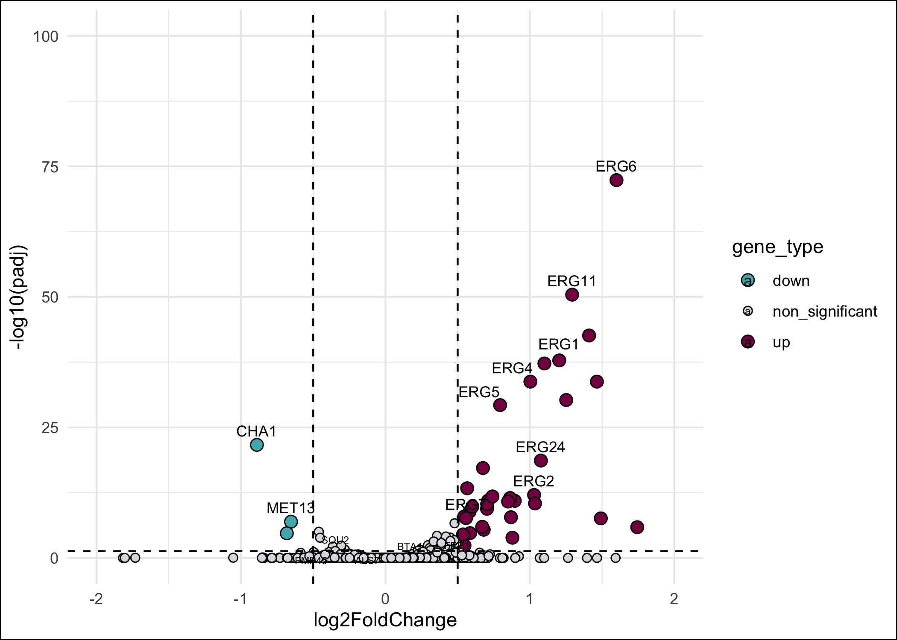
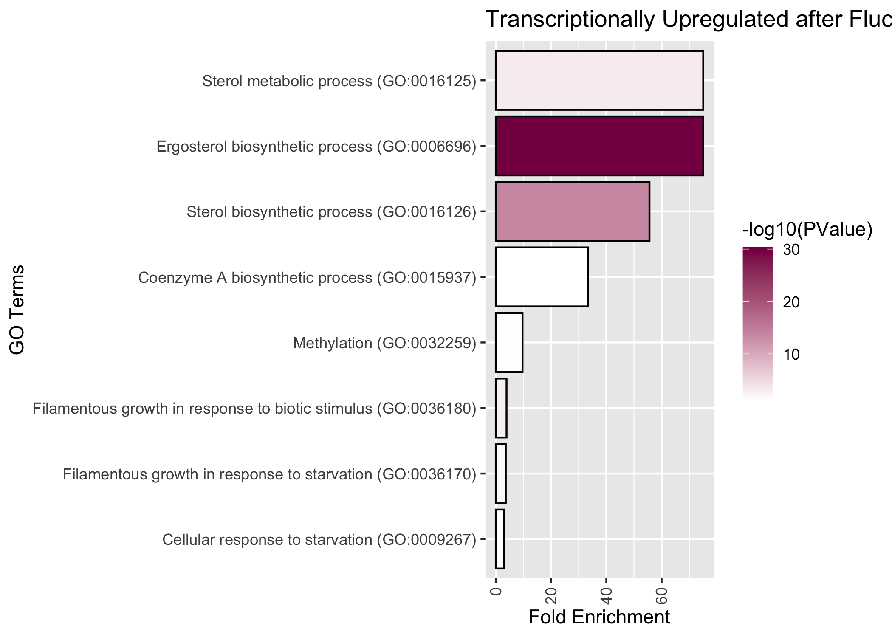
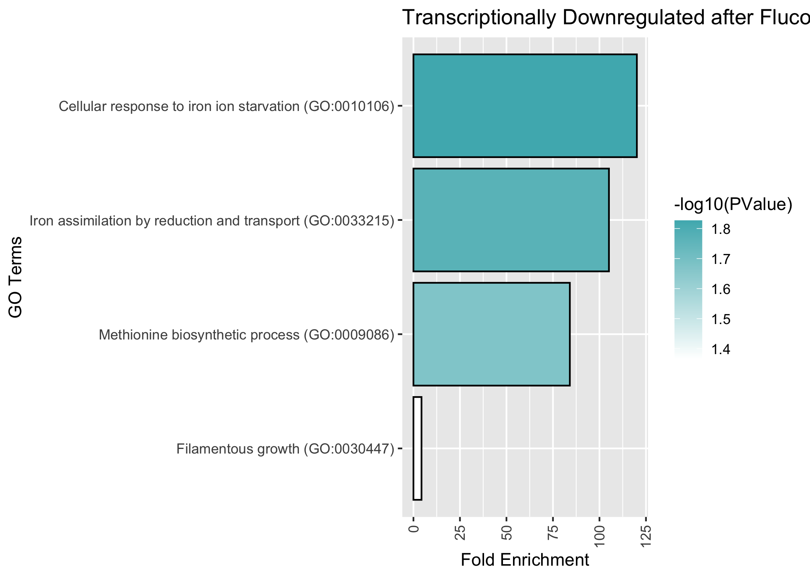
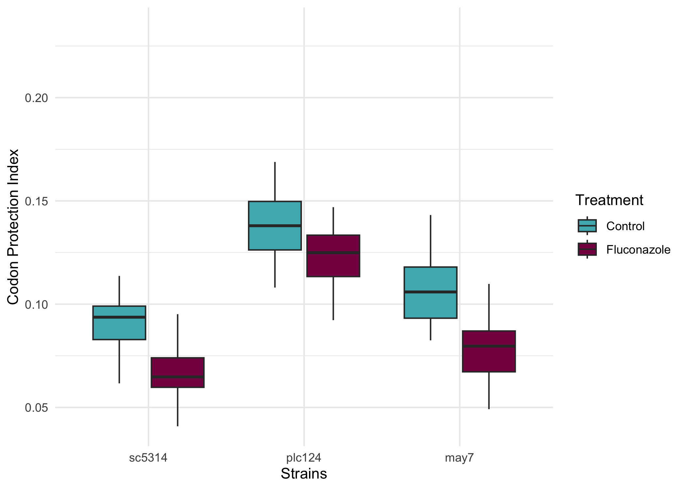
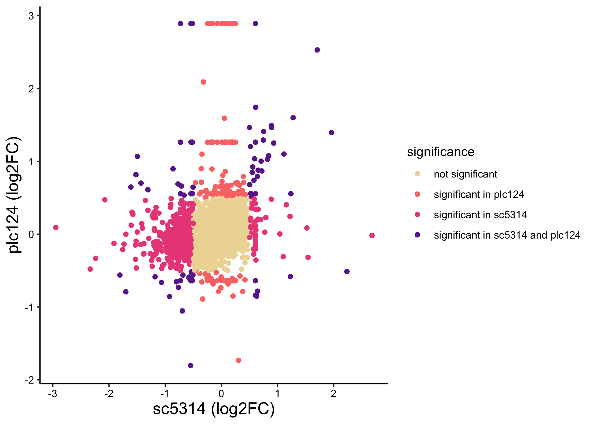

## Figure 4

Irene Stevens

23/05/2023

# This script will generate Figure 4: Transcriptional and post-transcriptional response after Fluconazole in resistant C. albicans

## Load libraries

``` r
library(DESeq2)
```

    ## Loading required package: S4Vectors

    ## Loading required package: stats4

    ## Loading required package: BiocGenerics

    ## 
    ## Attaching package: 'BiocGenerics'

    ## The following objects are masked from 'package:stats':
    ## 
    ##     IQR, mad, sd, var, xtabs

    ## The following objects are masked from 'package:base':
    ## 
    ##     anyDuplicated, aperm, append, as.data.frame, basename, cbind,
    ##     colnames, dirname, do.call, duplicated, eval, evalq, Filter, Find,
    ##     get, grep, grepl, intersect, is.unsorted, lapply, Map, mapply,
    ##     match, mget, order, paste, pmax, pmax.int, pmin, pmin.int,
    ##     Position, rank, rbind, Reduce, rownames, sapply, setdiff, sort,
    ##     table, tapply, union, unique, unsplit, which.max, which.min

    ## 
    ## Attaching package: 'S4Vectors'

    ## The following objects are masked from 'package:base':
    ## 
    ##     expand.grid, I, unname

    ## Loading required package: IRanges

    ## Loading required package: GenomicRanges

    ## Loading required package: GenomeInfoDb

    ## Loading required package: SummarizedExperiment

    ## Loading required package: MatrixGenerics

    ## Loading required package: matrixStats

    ## 
    ## Attaching package: 'MatrixGenerics'

    ## The following objects are masked from 'package:matrixStats':
    ## 
    ##     colAlls, colAnyNAs, colAnys, colAvgsPerRowSet, colCollapse,
    ##     colCounts, colCummaxs, colCummins, colCumprods, colCumsums,
    ##     colDiffs, colIQRDiffs, colIQRs, colLogSumExps, colMadDiffs,
    ##     colMads, colMaxs, colMeans2, colMedians, colMins, colOrderStats,
    ##     colProds, colQuantiles, colRanges, colRanks, colSdDiffs, colSds,
    ##     colSums2, colTabulates, colVarDiffs, colVars, colWeightedMads,
    ##     colWeightedMeans, colWeightedMedians, colWeightedSds,
    ##     colWeightedVars, rowAlls, rowAnyNAs, rowAnys, rowAvgsPerColSet,
    ##     rowCollapse, rowCounts, rowCummaxs, rowCummins, rowCumprods,
    ##     rowCumsums, rowDiffs, rowIQRDiffs, rowIQRs, rowLogSumExps,
    ##     rowMadDiffs, rowMads, rowMaxs, rowMeans2, rowMedians, rowMins,
    ##     rowOrderStats, rowProds, rowQuantiles, rowRanges, rowRanks,
    ##     rowSdDiffs, rowSds, rowSums2, rowTabulates, rowVarDiffs, rowVars,
    ##     rowWeightedMads, rowWeightedMeans, rowWeightedMedians,
    ##     rowWeightedSds, rowWeightedVars

    ## Loading required package: Biobase

    ## Welcome to Bioconductor
    ## 
    ##     Vignettes contain introductory material; view with
    ##     'browseVignettes()'. To cite Bioconductor, see
    ##     'citation("Biobase")', and for packages 'citation("pkgname")'.

    ## 
    ## Attaching package: 'Biobase'

    ## The following object is masked from 'package:MatrixGenerics':
    ## 
    ##     rowMedians

    ## The following objects are masked from 'package:matrixStats':
    ## 
    ##     anyMissing, rowMedians

``` r
library(ggplot2)
library(ggrepel)
library(tidyverse)
```

    ## ── Attaching core tidyverse packages ──────────────────────── tidyverse 2.0.0 ──
    ## ✔ dplyr     1.1.2     ✔ readr     2.1.4
    ## ✔ forcats   1.0.0     ✔ stringr   1.5.0
    ## ✔ lubridate 1.9.2     ✔ tibble    3.2.1
    ## ✔ purrr     1.0.2     ✔ tidyr     1.3.0

    ## ── Conflicts ────────────────────────────────────────── tidyverse_conflicts() ──
    ## ✖ lubridate::%within%() masks IRanges::%within%()
    ## ✖ dplyr::collapse()     masks IRanges::collapse()
    ## ✖ dplyr::combine()      masks Biobase::combine(), BiocGenerics::combine()
    ## ✖ dplyr::count()        masks matrixStats::count()
    ## ✖ dplyr::desc()         masks IRanges::desc()
    ## ✖ tidyr::expand()       masks S4Vectors::expand()
    ## ✖ dplyr::filter()       masks stats::filter()
    ## ✖ dplyr::first()        masks S4Vectors::first()
    ## ✖ dplyr::lag()          masks stats::lag()
    ## ✖ ggplot2::Position()   masks BiocGenerics::Position(), base::Position()
    ## ✖ purrr::reduce()       masks GenomicRanges::reduce(), IRanges::reduce()
    ## ✖ dplyr::rename()       masks S4Vectors::rename()
    ## ✖ lubridate::second()   masks S4Vectors::second()
    ## ✖ lubridate::second<-() masks S4Vectors::second<-()
    ## ✖ dplyr::slice()        masks IRanges::slice()
    ## ℹ Use the conflicted package (<http://conflicted.r-lib.org/>) to force all conflicts to become errors

## Perform differential expression analysis for plc124 in response to Fluconazole

Load data and metadata

``` r
ctx<-as.matrix(read.delim("/Users/vip/Documents/Candida/RNA-seq/counts_plc124.txt", sep="\t", row.names = 1, header=T, check.names=F,stringsAsFactors = TRUE))
coldata<-read.delim("/Users/vip/Documents/Candida/RNA-seq/metadata_plc124.txt",row.names=1,stringsAsFactors = TRUE)
coldata<-coldata[,c("Treatment","Replicate")]
coldata$Treatment<-factor(coldata$Treatment)
```

Set reference level: Control (not treated)

``` r
coldata$Treatment=relevel(coldata$Treatment, 'Control')
```

Perform differential expression analysis (for more details, please see
‘Figure 4’ R script in Figures folder)

``` r
dds <- DESeqDataSetFromMatrix(countData=ctx,  colData = coldata, design <- ~Treatment)
dds<-DESeq(dds)
```

    ## estimating size factors

    ## estimating dispersions

    ## gene-wise dispersion estimates

    ## mean-dispersion relationship

    ## final dispersion estimates

    ## fitting model and testing

``` r
sd <- rlog(dds,blind=TRUE)
res = results(dds, contrast=c("Treatment","Fluconazole","Control"))
ix = which.min(res$padj)
res <- res[order(res$padj),]    
summary(res)
```

    ## 
    ## out of 6004 with nonzero total read count
    ## adjusted p-value < 0.1
    ## LFC > 0 (up)       : 70, 1.2%
    ## LFC < 0 (down)     : 15, 0.25%
    ## outliers [1]       : 0, 0%
    ## low counts [2]     : 0, 0%
    ## (mean count < 0)
    ## [1] see 'cooksCutoff' argument of ?results
    ## [2] see 'independentFiltering' argument of ?results

## Figure 4A. Volcano plot

Load DEG of PLC124 in response to Fluconazole

``` r
ctx<-read.delim("/Users/vip/Documents/Candida/RNA-seq/DEG_plc124_geneid.txt", sep="\t", header=T)
```

Create volcano plot

``` r
ctx <- ctx %>%
  mutate(
    gene_type = case_when(
      log2FoldChange >= 0.5 & padj <= 0.05 ~ "up",
      log2FoldChange <= -0.5 & padj <= 0.05 ~ "down",
      TRUE ~ "non_significant"
    )
  )

cols <- c("up" = "#870052", "down" = "#4DB5BC", "non_significant" = "#DDDEE0")
sizes <- c("up" = 3, "down" = 3, "non_significant" = 2)
alphas <- c("up" = 3, "down" = 3, "non_significant" = 2)


ctx %>%
  ggplot(aes(x = log2FoldChange, y = -log10(padj), fill = gene_type, size = gene_type, alpha = gene_type)) +
  geom_point(shape = 21, colour = "black") +
  geom_hline(yintercept = -log10(0.05), linetype = "dashed") +
  geom_vline(xintercept = c(-0.5, 0.5), linetype = "dashed") +
  scale_fill_manual(values = cols) +
  scale_size_manual(values = sizes) +
  scale_alpha_manual(values = alphas) +
  scale_x_continuous(breaks = c(seq(-3, 3, 2)), limits = c(-8, 8)) +
  geom_text_repel(
    data = ctx %>%
      filter(gene_id %in% c("ERG251", "ERG6", "ERG1", "ERG24", "MET13", "FRP1", "ERG11", "CHA1", "ERG2", "ERG5", "ERG4", "FMP45", "BTA1", "ERG7", "ALS7", "SOU2")),
    aes(label = gene_id),
    force = 2,
    nudge_y = 1
  ) +
  scale_colour_manual(values = cols) +
  scale_x_continuous(breaks = c(seq(-2, 2, 1)), limits = c(-2, 2)) + 
  coord_cartesian(ylim = c(0, 100)) +  # Set y-axis limit to 0 to 100
  theme_minimal() +  # Set the plot theme to minimal
  theme(plot.background = element_rect(fill = "white"))  # Change the background color to white
```

    ## Scale for x is already present.
    ## Adding another scale for x, which will replace the existing scale.

    ## Warning: Removed 29 rows containing missing values (`geom_point()`).

    ## Warning: Removed 1 rows containing missing values (`geom_text_repel()`).

<!-- -->

## Figure 4B. Barplot of enriched Gene Ontrology Terms from DAVID

Load DAVID enriched terms (see Suplementary Table S4)

``` r
data_up <- read.delim('/Users/vip/Documents/Candida/RNA-seq/up_plc124.txt', header = TRUE)
data_up <- data_up[order(-data_up$Fold.Enrichment), ]

data_down <- read.delim('/Users/vip/Documents/Candida/RNA-seq/down_plc.txt', header = TRUE)
data_down <- data_down[order(-data_down$Fold.Enrichment), ]
```

Plot Upregulated Pathways in Resistant strain PLC124 after Fluconazole

``` r
ggplot(data_up, aes(x = reorder(Term, Fold.Enrichment), y = Fold.Enrichment, fill = -log10(PValue))) +
  coord_flip() +
  geom_bar(stat = "identity", color = "black") +
  scale_fill_gradient(low = "white", high = "#870052") +
  theme(axis.text.x = element_text(angle = 90, hjust = 1, vjust = 0.5)) +
  labs(x = "GO Terms", y = "Fold Enrichment", title = "Transcriptionally Upregulated after Fluconazole in PLC124")
```

<!-- -->

Plot Downregulated Pathways in resistant strain PLC124 after Fluconazole

``` r
ggplot(data_down, aes(x = reorder(Term, Fold.Enrichment), y = Fold.Enrichment, fill = -log10(PValue))) +
  coord_flip() +
  geom_bar(stat = "identity", color = "black") +
  scale_fill_gradient(low = "white", high = "#4DB5BC") +
  theme(axis.text.x = element_text(angle = 90, hjust = 1, vjust = 0.5)) +
  labs(x = "GO Terms", y = "Fold Enrichment", title = "Transcriptionally Downregulated after Fluconazole in PLC124")
```

<!-- -->

## Figure 4D. Codon Protection Index in sensitive and resistant Candida after Fluconazole

Input file was obtained from amino_acid_stats.txt files (FPI column),
the average for three biological replicates was calculated, and then
converted from a wide format to a long format using library(reshape2).

Load Data:

``` r
data<-read.delim('/Users/vip/Desktop/Figures/raw/melted_df.txt', header=T)
```

Reorder the levels of the “strain” variable

``` r
data$strain <- factor(data$strain, levels = c("sc5314", "plc124", "may7"))
```

Create the boxplot

``` r
p <- ggplot(data, aes(x = strain, y = value, fill = Treatment)) +
  geom_boxplot(outlier.shape = NA) +  # Remove outliers
  scale_color_manual(values = c("Control" = "#4DB5BC", "Fluconazole" =  "#870052"))  +
  scale_fill_manual(values = c("Control" = "#4DB5BC", "Fluconazole" =  "#870052")) +
  labs(
    x = "Strains",
    y = "Codon Protection Index"
  ) +
  theme_minimal() +
  theme(axis.text.x = element_text(hjust = 0.5))  # Center x-axis labels

p
```

<!-- -->

Check statistical significance of treatment effect for each strain

``` r
t_test_sc5314 <- with(data, t.test(value ~ Treatment, data = subset(data, strain == "sc5314")))
t_test_plc124 <- with(data, t.test(value ~ Treatment, data = subset(data, strain == "plc124")))
t_test_may7 <- with(data, t.test(value ~ Treatment, data = subset(data, strain == "may7")))

t_test_sc5314
```

    ## 
    ##  Welch Two Sample t-test
    ## 
    ## data:  value by Treatment
    ## t = 3.8403, df = 38.367, p-value = 0.0004476
    ## alternative hypothesis: true difference in means between group Control and group Fluconazole is not equal to 0
    ## 95 percent confidence interval:
    ##  0.01070931 0.03457130
    ## sample estimates:
    ##     mean in group Control mean in group Fluconazole 
    ##                0.09232467                0.06968436

``` r
t_test_plc124
```

    ## 
    ##  Welch Two Sample t-test
    ## 
    ## data:  value by Treatment
    ## t = 2.503, df = 37.543, p-value = 0.01679
    ## alternative hypothesis: true difference in means between group Control and group Fluconazole is not equal to 0
    ## 95 percent confidence interval:
    ##  0.00331464 0.03141128
    ## sample estimates:
    ##     mean in group Control mean in group Fluconazole 
    ##                 0.1415814                 0.1242185

``` r
t_test_may7
```

    ## 
    ##  Welch Two Sample t-test
    ## 
    ## data:  value by Treatment
    ## t = 2.7115, df = 39.972, p-value = 0.009827
    ## alternative hypothesis: true difference in means between group Control and group Fluconazole is not equal to 0
    ## 95 percent confidence interval:
    ##  0.006972102 0.047797327
    ## sample estimates:
    ##     mean in group Control mean in group Fluconazole 
    ##                0.11192335                0.08453863

## Figure 4E. Sensitive versus Resistant expression profiles

Load data from DEG lists.

``` r
data <- read.table("/Users/vip/Documents/Candida/RNA-seq/DEG_sc5314_plc124_log2FoldChange.txt", header = TRUE)
```

Create a new column with significance

``` r
data$significance <- ifelse(abs(data$log2FoldChange.sc5314) < 0.5 & abs(data$log2FoldChange.plc124) < 0.5, "not significant",
                            ifelse(abs(data$log2FoldChange.sc5314) >= 0.5 & abs(data$log2FoldChange.plc124) < 0.5, "significant in sc5314",
                                   ifelse(abs(data$log2FoldChange.sc5314) < 0.5 & abs(data$log2FoldChange.plc124) >= 0.5, "significant in plc124",
                                          "significant in sc5314 and plc124")))
```

Plot the scatterplot

``` r
ggplot(data, aes(x = log2FoldChange.sc5314, y = log2FoldChange.plc124, color = significance)) +
  geom_point() +
  scale_color_manual(values = c("not significant" = "#EDD9A3", "significant in sc5314" = "#EA4F88", "significant in plc124" = "#FA7876", "significant in sc5314 and plc124" = "#692A99")) +
  labs(x = "sc5314 (log2FC)", y = "plc124 (log2FC)") +
  theme_classic() +
  theme(panel.background = element_rect(fill = "white"),
        axis.line = element_line(color = "black"),
        axis.text = element_text(color = "black"),
        axis.title = element_text(color = "black", size = 14),
        plot.title = element_text(color = "black", size = 16, face = "bold"))
```

    ## Warning: Removed 66 rows containing missing values (`geom_point()`).

<!-- -->

Count the occurrences of each category

``` r
table(data$significance)
```

    ## 
    ##                  not significant            significant in plc124 
    ##                             5574                              128 
    ##            significant in sc5314 significant in sc5314 and plc124 
    ##                              571                               72

See some genes in the “significant in sc5314” category

``` r
sc5314<-subset(data, significance == "significant in sc5314")
sc5314
```

    ##               gene_id log2FoldChange.sc5314 log2FoldChange.plc124
    ## 3                AAF1            -0.8252389         -0.2829306256
    ## 5                AAP1            -0.5705526         -0.0566174688
    ## 18               ACE2            -0.8612785         -0.2954639876
    ## 21               ACO1            -1.1567913         -0.1886317418
    ## 42               ADH4            -0.5509800          0.2626024555
    ## 50               AFL1            -0.7967867         -0.0859470451
    ## 52               AFT2            -0.5889917         -0.1793811359
    ## 88               ALS2            -0.7031412         -0.2893210134
    ## 90               ALS4            -0.7017495         -0.2344225777
    ## 93               ALS7            -1.1735704         -0.2696926140
    ## 94               ALS9            -0.6091858         -0.1416012027
    ## 104              AOX2            -0.7126292          0.0281488437
    ## 117              APS3             0.5103057          0.1042728234
    ## 119              AQY1            -0.5290188          0.1384002388
    ## 136              ARG4            -0.6263090          0.1524725591
    ## 139             ARG81            -0.5341749         -0.0860642991
    ## 141              ARH2            -0.7587058         -0.0969137956
    ## 166              ASG7            -0.7957188         -0.4690490542
    ## 173              ASR2             0.7724068          0.0279590349
    ## 177              ATG1            -0.8304839         -0.0348225294
    ## 184              ATO5            -0.6618121         -0.1737584661
    ## 186              ATO7            -0.5685288         -0.4112589788
    ## 188              ATP1            -1.1750988         -0.1038249639
    ## 194              ATP2            -0.5247152         -0.1209141399
    ## 202              AUR1            -1.0833329         -0.1279207007
    ## 205              AVT4            -0.8196865         -0.0327650536
    ## 212             BAT21            -0.7706449          0.0503967726
    ## 215              BCK1            -0.5600300         -0.1940647456
    ## 216              BCR1            -0.5912190         -0.2317265030
    ## 227             BGL22            -0.6140455         -0.2769054235
    ## 235              BMT1            -0.8465644          0.1477397086
    ## 251              BRG1            -0.7994660         -0.2638096292
    ## 253              BRO1            -0.5206567          0.0228587448
    ## 254              BTA1            -1.2291858          0.2503764112
    ## 276  CAALFM_C100090WA            -0.5270330         -0.1894387321
    ## 279  CAALFM_C100190CA            -0.6066540         -0.1539319667
    ## 295  CAALFM_C100530CA            -0.7123122         -0.0846485161
    ## 299  CAALFM_C100630WA            -0.6239351         -0.0244847300
    ## 306  CAALFM_C100830WA            -0.9071868          0.3673818763
    ## 327  CAALFM_C101210WA            -0.8020638         -0.1507259156
    ## 333  CAALFM_C101360CA            -0.5802259         -0.2191653267
    ## 334  CAALFM_C101390CA            -0.5057714         -0.1415944903
    ## 361  CAALFM_C101970WA            -1.1135353         -0.3498395073
    ## 392  CAALFM_C102670CA            -0.5860009         -0.0845121387
    ## 397  CAALFM_C102730WA            -0.5445885         -0.2365662001
    ## 414  CAALFM_C103050WA            -0.6457483         -0.0785313188
    ## 444  CAALFM_C103690WA            -1.1932382          0.0779033826
    ## 454  CAALFM_C103920CA            -0.5345090         -0.1267241770
    ## 473  CAALFM_C104270CA            -0.5136967         -0.0089578721
    ## 482  CAALFM_C104470CA             0.8883589          0.4804841942
    ## 489  CAALFM_C104600CA            -0.6020382         -0.0191228023
    ## 493  CAALFM_C104690CA            -0.5408442          0.0237258364
    ## 496  CAALFM_C104720WA            -0.8439698          0.0190035077
    ## 499  CAALFM_C104800CA            -0.6293114          0.0927983849
    ## 504  CAALFM_C104930CA            -0.5820346          0.2241605596
    ## 513  CAALFM_C105150CA            -0.8995474          0.4110950622
    ## 536  CAALFM_C105520WA            -1.0409170         -0.0416413627
    ## 543  CAALFM_C105690CA            -0.9481909         -0.0846247608
    ## 551  CAALFM_C105890WA            -0.7001601          0.0163755869
    ## 556  CAALFM_C105970WA            -1.2113369          0.2818655045
    ## 559  CAALFM_C106000WA            -0.5047151         -0.1730110538
    ## 565  CAALFM_C106150WA            -2.2388286         -0.3315150225
    ## 573  CAALFM_C106340WA            -0.7105226          0.1108040809
    ## 581  CAALFM_C106430CA            -1.1116810          0.2887299764
    ## 592  CAALFM_C106620CA             0.5850174          0.1480078027
    ## 606  CAALFM_C106860WA            -0.8080783          0.2274166488
    ## 608  CAALFM_C106890CA            -1.7554786         -0.2107478866
    ## 614  CAALFM_C107040CA            -0.7388954         -0.0543030369
    ## 653  CAALFM_C107860WA            -0.5958261         -0.0097764608
    ## 674  CAALFM_C108520CA            -0.6903588         -0.1928025965
    ## 687  CAALFM_C108780WA            -0.5767948          0.0459928571
    ## 695  CAALFM_C108910CA            -0.5460854          0.0110788642
    ## 716  CAALFM_C109430WA            -0.5435688         -0.0377157017
    ## 722  CAALFM_C109550WA            -0.5857839          0.4151650658
    ## 733  CAALFM_C109780CA            -0.5143999          0.0031151262
    ## 744  CAALFM_C110050WA            -1.3779178         -0.1293726972
    ## 753  CAALFM_C110200CA            -0.5144415          0.1117103624
    ## 772  CAALFM_C110540CA            -0.7627367         -0.2286401900
    ## 794  CAALFM_C110980WA            -0.6301943          0.0390374167
    ## 814  CAALFM_C111320CA            -0.5160260         -0.2344423149
    ## 826  CAALFM_C111620WA            -0.6944924         -0.2246751585
    ## 829  CAALFM_C111690WA            -0.5463620         -0.1660841521
    ## 830  CAALFM_C111710CA            -0.6043665          0.0468296722
    ## 831  CAALFM_C111720WA            -0.8339797         -0.2132418938
    ## 846  CAALFM_C111940CA            -0.8385868         -0.2283002588
    ## 848  CAALFM_C111960CA            -0.7815694          0.0541055937
    ## 851  CAALFM_C112000CA            -0.7121743         -0.1135413711
    ## 858  CAALFM_C112140WA            -0.5005810          0.0300901916
    ## 875  CAALFM_C112570CA            -0.6125595         -0.0423641531
    ## 903  CAALFM_C112940CA            -0.7121203         -0.1733003185
    ## 911  CAALFM_C113190WA            -0.5222693          0.0704093670
    ## 933  CAALFM_C113820CA            -0.7745967         -0.1914037380
    ## 935  CAALFM_C113880CA            -0.5727459         -0.1074545247
    ## 937  CAALFM_C114020WA            -1.1964198          0.3049475077
    ## 953  CAALFM_C114320CA            -0.9888944         -0.1850558804
    ## 954  CAALFM_C114330WA            -0.8624660         -0.0223221578
    ## 958  CAALFM_C114430CA            -0.8456097         -0.2022947574
    ## 963  CAALFM_C114500CA            -0.7994860         -0.1714326237
    ## 968  CAALFM_C114580CA            -0.5351324         -0.0990788846
    ## 972  CAALFM_C200110WA            -1.2437365         -0.3628965854
    ## 992  CAALFM_C200540WA            -0.6632031          0.0307677336
    ## 1014 CAALFM_C200860CA            -0.6841012         -0.1764958844
    ## 1017 CAALFM_C200890WA            -0.8207254         -0.3247684639
    ## 1018 CAALFM_C200900WA            -0.9313906          0.0243203849
    ## 1059 CAALFM_C201760CA            -0.5357555          0.2685010838
    ## 1060 CAALFM_C201800WA            -0.5957285         -0.1764271705
    ## 1073 CAALFM_C202110CA             0.6482159          0.2063602569
    ## 1102 CAALFM_C202570WA            -0.5265945         -0.0081986134
    ## 1112 CAALFM_C202750CA            -0.5485195         -0.2547003422
    ## 1126 CAALFM_C203020CA            -0.7121146          0.0543788294
    ## 1141 CAALFM_C203490CA            -0.9787622         -0.1282320543
    ## 1150 CAALFM_C203710WA            -0.7735331          0.2246430579
    ## 1171 CAALFM_C204180CA            -0.5587837         -0.0551614386
    ## 1173 CAALFM_C204300CA            -0.6515377          0.2100062527
    ## 1183 CAALFM_C204430WA            -1.1341089         -0.1655239106
    ## 1211 CAALFM_C205170WA            -0.8970078         -0.3743395853
    ## 1216 CAALFM_C205330CA            -0.5348993         -0.2432194443
    ## 1231 CAALFM_C205580WA            -0.5063717         -0.2006208799
    ## 1233 CAALFM_C205640WA            -1.2317817         -0.4403673066
    ## 1258 CAALFM_C206120CA            -0.5405694         -0.0741597735
    ## 1259 CAALFM_C206140CA            -0.5829141          0.3274002946
    ## 1264 CAALFM_C206270WA            -0.5679728         -0.2109378599
    ## 1265 CAALFM_C206280CA            -0.5715861         -0.1482164548
    ## 1285 CAALFM_C206750CA            -1.2073664          0.2239232251
    ## 1310 CAALFM_C207190CA            -0.8024107         -0.1327423573
    ## 1318 CAALFM_C207360WA            -0.6776832         -0.0262061481
    ## 1332 CAALFM_C207620WA            -0.8553600         -0.0919824519
    ## 1333 CAALFM_C207630CA             1.5222752          0.0861018762
    ## 1343 CAALFM_C207770CA            -0.5918550         -0.1899533656
    ## 1354 CAALFM_C208030WA            -0.7621142         -0.1538378637
    ## 1364 CAALFM_C208260WA            -1.3532719          0.4625695061
    ## 1366 CAALFM_C208320CA            -0.5881932         -0.3355128210
    ## 1368 CAALFM_C208340CA            -0.6617484          0.3252315531
    ## 1374 CAALFM_C208450WA            -0.5851838         -0.3706207325
    ## 1377 CAALFM_C208520CA            -1.0602706         -0.2306745317
    ## 1380 CAALFM_C208580WA            -0.5030599         -0.0706675296
    ## 1403 CAALFM_C209000CA            -0.5258657         -0.0886924758
    ## 1414 CAALFM_C209280CA            -0.5254479         -0.2434318444
    ## 1415 CAALFM_C209290WA            -0.5701559         -0.1636325076
    ## 1417 CAALFM_C209330CA            -0.7611370          0.1392487279
    ## 1420 CAALFM_C209420WA            -0.9058977         -0.2707394271
    ## 1424 CAALFM_C209510CA            -0.6111282         -0.1294421917
    ## 1429 CAALFM_C209610WA            -0.5010969         -0.0164557476
    ## 1435 CAALFM_C209680WA            -0.8615949         -0.0426607643
    ## 1441 CAALFM_C209800CA            -0.6576505          0.4263812491
    ## 1445 CAALFM_C209850CA            -0.6713088         -0.3332570195
    ## 1463 CAALFM_C210130WA            -0.5742917          0.0714945365
    ## 1475 CAALFM_C210540WA            -0.8772331         -0.4072850211
    ## 1478 CAALFM_C210650WA             0.7915362          0.2285104338
    ## 1479 CAALFM_C210670WA            -0.5725524         -0.3786854668
    ## 1496 CAALFM_C300100WA            -1.1627180         -0.2652171596
    ## 1510 CAALFM_C300360WA            -0.5102942         -0.1914803576
    ## 1541 CAALFM_C300990CA            -0.5824155          0.2142188585
    ## 1544 CAALFM_C301060WA            -0.5149065          0.3598802448
    ## 1559 CAALFM_C301260CA            -0.8648185         -0.4370566061
    ## 1567 CAALFM_C301540WA             2.6812185         -0.0176567649
    ## 1570 CAALFM_C301590WA            -0.6491829         -0.0215082206
    ## 1576 CAALFM_C301680CA            -0.5081205          0.0071132157
    ## 1588 CAALFM_C301910CA            -0.9757653         -0.0910648250
    ## 1600 CAALFM_C302120WA            -0.6929269         -0.0621109071
    ## 1607 CAALFM_C302250CA            -1.1627454          0.3680959768
    ## 1623 CAALFM_C302660WA            -0.5937205         -0.3129551970
    ## 1628 CAALFM_C302750WA            -0.8307243          0.0786264130
    ## 1637 CAALFM_C302890CA            -0.9570265          0.1253378971
    ## 1643 CAALFM_C302980CA            -0.9112408          0.0633370600
    ## 1644 CAALFM_C302990CA            -0.8475039         -0.0255326973
    ## 1652 CAALFM_C303130CA            -1.3071410          0.3282347183
    ## 1658 CAALFM_C303230CA            -0.6855880          0.0203438979
    ## 1672 CAALFM_C303470WA            -0.7962913          0.1009782073
    ## 1677 CAALFM_C303570CA            -0.7025414         -0.2754581501
    ## 1700 CAALFM_C304190WA            -0.6045536          0.0030609454
    ## 1724 CAALFM_C304730CA            -1.0114740         -0.0533320661
    ## 1745 CAALFM_C305160CA            -0.6851356         -0.1166281112
    ## 1750 CAALFM_C305320WA            -0.6202060         -0.1147735293
    ## 1764 CAALFM_C305640WA            -0.8555331          0.2457899018
    ## 1765 CAALFM_C305660CA            -0.7287537         -0.2217386638
    ## 1767 CAALFM_C305750CA            -0.5657857          0.2154708130
    ## 1771 CAALFM_C305840WA            -0.7605538         -0.0836208836
    ## 1779 CAALFM_C305990CA            -0.5769211         -0.2268312328
    ## 1780 CAALFM_C306040WA            -0.8824038          0.0022418918
    ## 1784 CAALFM_C306150WA            -0.6177862         -0.2400555888
    ## 1798 CAALFM_C306440WA            -0.7404227         -0.0146663141
    ## 1806 CAALFM_C306610WA            -0.5915965         -0.0965034374
    ## 1809 CAALFM_C306660CA            -0.6601954          0.1501928852
    ## 1841 CAALFM_C307280CA            -0.5549239         -0.1811427256
    ## 1856 CAALFM_C307540CA            -0.5407520         -0.1238959679
    ## 1876 CAALFM_C307880CA            -1.2666095         -0.2658123119
    ## 1877 CAALFM_C307900CA            -0.7155313         -0.2729070734
    ## 1879 CAALFM_C307920WA            -0.6088420         -0.1364892834
    ## 1887 CAALFM_C400080CA            -0.5548912         -0.0262540763
    ## 1895 CAALFM_C400290CA            -0.8782040         -0.0550292322
    ## 1901 CAALFM_C400420CA            -0.8203189         -0.1465786224
    ## 1906 CAALFM_C400530CA            -1.1686520          0.2254942663
    ## 1911 CAALFM_C400640WA            -1.1293059         -0.1023760240
    ## 1938 CAALFM_C401220CA            -0.5443519         -0.1916463022
    ## 1953 CAALFM_C401650CA            -0.5136564         -0.1248812745
    ## 1981 CAALFM_C402190CA            -0.5299787          0.4205673508
    ## 1984 CAALFM_C402230CA            -0.5604810         -0.2830391009
    ## 1985 CAALFM_C402240CA            -1.5754821          0.2726159886
    ## 1988 CAALFM_C402340WA            -0.5138989          0.1635237656
    ## 2035 CAALFM_C403300CA            -0.6793281          0.3212336165
    ## 2036 CAALFM_C403310CA            -1.6995800         -0.0001609208
    ## 2043 CAALFM_C403460CA            -0.5089586          0.0565811061
    ## 2045 CAALFM_C403490CA            -0.6833089         -0.0154937776
    ## 2046 CAALFM_C403500CA            -0.9709764          0.0248052791
    ## 2054 CAALFM_C403710CA            -0.5296845         -0.0709873243
    ## 2055 CAALFM_C403720CA            -0.6188646          0.1487738786
    ## 2059 CAALFM_C403760WA            -1.5318585         -0.1486218925
    ## 2072 CAALFM_C404010WA            -0.8223288         -0.3079566864
    ## 2074 CAALFM_C404040WA            -0.8940004          0.4892807885
    ## 2090 CAALFM_C404330CA            -0.8178482         -0.0964067416
    ## 2098 CAALFM_C404500CA            -0.9675129         -0.0821809784
    ## 2107 CAALFM_C404660CA            -0.5778986         -0.2282403934
    ## 2129 CAALFM_C405200CA            -0.7250275          0.3417209844
    ## 2138 CAALFM_C405350WA            -0.5551403         -0.0492796133
    ## 2144 CAALFM_C405580CA            -1.0037533         -0.1159411336
    ## 2151 CAALFM_C405730WA            -0.5119216         -0.2142086536
    ## 2160 CAALFM_C405870CA            -0.6985945         -0.2736134521
    ## 2191 CAALFM_C406620CA            -2.3341211         -0.4784770728
    ## 2192 CAALFM_C406630CA            -1.0615158         -0.4703190901
    ## 2195 CAALFM_C406660WA            -0.9180868         -0.0302345440
    ## 2210 CAALFM_C406910WA            -0.6401254          0.1804805362
    ## 2214 CAALFM_C407000WA            -0.7095614         -0.4430815018
    ## 2216 CAALFM_C407020CA            -0.5022252          0.4080802796
    ## 2223 CAALFM_C407150WA            -0.5856457         -0.0294879701
    ## 2226 CAALFM_C407200CA            -0.9458014         -0.3634133010
    ## 2228 CAALFM_C407220CA            -0.6215556         -0.3185467657
    ## 2230 CAALFM_C500030WA            -0.7632548         -0.3721419036
    ## 2242 CAALFM_C500170WA            -1.4373451         -0.1435307778
    ## 2255 CAALFM_C500510WA            -0.6936063         -0.2812948432
    ## 2286 CAALFM_C501220WA            -0.6720370         -0.2368991690
    ## 2288 CAALFM_C501260WA            -0.6653860          0.2319461036
    ## 2289 CAALFM_C501290CA             0.5237544          0.2150452475
    ## 2301 CAALFM_C501550CA            -0.6988578          0.1343288618
    ## 2315 CAALFM_C501990WA            -0.7073914          0.4648193863
    ## 2359 CAALFM_C502800CA            -0.6721821          0.2250558199
    ## 2392 CAALFM_C503520WA            -0.7548859          0.1801228354
    ## 2404 CAALFM_C503730WA            -0.6601262         -0.3572299100
    ## 2410 CAALFM_C503830CA            -0.9044370         -0.0771394665
    ## 2417 CAALFM_C503920CA             0.5242777          0.0158267030
    ## 2424 CAALFM_C504010CA            -0.6218113         -0.1947446777
    ## 2446 CAALFM_C504460CA            -2.9469685          0.0927025521
    ## 2448 CAALFM_C504480CA             0.5990238         -0.0177528263
    ## 2465 CAALFM_C504870WA            -0.5260582         -0.2062837761
    ## 2485 CAALFM_C505180WA            -0.7241672          0.2946554844
    ## 2487 CAALFM_C505210WA             0.5377144          0.3596335464
    ## 2500 CAALFM_C600090WA            -0.6682027         -0.1915005108
    ## 2566 CAALFM_C601400WA            -1.4977832          0.0297759042
    ## 2597 CAALFM_C602140WA            -0.7463370         -0.1815210096
    ## 2606 CAALFM_C602280WA            -0.7291003         -0.2483055561
    ## 2644 CAALFM_C602950CA            -0.7232361          0.0379674631
    ## 2676 CAALFM_C603460WA            -0.7636876         -0.1418266686
    ## 2685 CAALFM_C603600CA            -0.6185426          0.3094821690
    ## 2706 CAALFM_C604150WA            -0.8085400          0.1233133784
    ## 2732 CAALFM_C700030WA            -0.5210088         -0.2441116335
    ## 2740 CAALFM_C700160CA            -0.8739051         -0.0880255945
    ## 2741 CAALFM_C700190WA            -0.7647961         -0.3273248799
    ## 2785 CAALFM_C701010WA            -0.5738715         -0.1084524081
    ## 2790 CAALFM_C701060WA            -1.3853471         -0.2717066657
    ## 2796 CAALFM_C701170CA            -0.8317587         -0.0249484213
    ## 2807 CAALFM_C701380WA            -1.0499431          0.1624780923
    ## 2810 CAALFM_C701430CA            -0.7851814         -0.1837692883
    ## 2837 CAALFM_C701960WA            -0.6908018         -0.1817929375
    ## 2850 CAALFM_C702210WA            -0.8835451          0.0226179055
    ## 2851 CAALFM_C702220CA            -0.7191569         -0.0902050947
    ## 2852 CAALFM_C702250WA            -0.9133750         -0.1147304198
    ## 2855 CAALFM_C702290WA            -0.5945008         -0.2118680742
    ## 2856 CAALFM_C702310CA            -0.5761418          0.1314748776
    ## 2890 CAALFM_C703150WA            -0.8986931          0.0064014045
    ## 2894 CAALFM_C703230CA            -0.6244237          0.2494420710
    ## 2909 CAALFM_C703550CA            -0.6730637          0.1755040492
    ## 2910 CAALFM_C703560WA            -0.6852268          0.4249342515
    ## 2925 CAALFM_C703830CA            -0.5973852          0.0735884220
    ## 2957 CAALFM_CR00060CA            -0.6026942         -0.1957596482
    ## 2981 CAALFM_CR00650WA            -0.5123920         -0.3416454842
    ## 2994 CAALFM_CR00880WA            -0.7904353         -0.0185727097
    ## 3003 CAALFM_CR01090WA            -0.5330687          0.0570439890
    ## 3010 CAALFM_CR01250CA            -0.7801927         -0.0033606857
    ## 3015 CAALFM_CR01340WA            -0.5164266          0.0657817106
    ## 3031 CAALFM_CR01630CA            -0.5177001          0.0146799847
    ## 3074 CAALFM_CR02770CA            -0.5405393          0.2185162602
    ## 3109 CAALFM_CR03410WA            -0.7063432          0.0204732998
    ## 3123 CAALFM_CR03620CA            -0.6364047         -0.2775030492
    ## 3126 CAALFM_CR03670WA            -0.8667539         -0.1968557990
    ## 3136 CAALFM_CR03870WA            -0.7717168          0.0262427773
    ## 3137 CAALFM_CR03910CA            -0.5471770         -0.2415200649
    ## 3174 CAALFM_CR04620CA            -0.9837451         -0.0807454565
    ## 3187 CAALFM_CR04870CA            -0.5157419          0.0238937216
    ## 3191 CAALFM_CR04970CA            -1.2175693         -0.3143883824
    ## 3192 CAALFM_CR04980CA            -1.4053381          0.0836746807
    ## 3203 CAALFM_CR05200CA            -0.6476903          0.0058675123
    ## 3237 CAALFM_CR06030CA            -0.5416132         -0.1311342443
    ## 3243 CAALFM_CR06140WA            -0.9072076         -0.3100202242
    ## 3251 CAALFM_CR06320CA            -0.6653757         -0.1636110951
    ## 3284 CAALFM_CR07020WA            -0.7343755         -0.0108660796
    ## 3288 CAALFM_CR07120CA            -0.5562870         -0.1024026553
    ## 3289 CAALFM_CR07140CA            -1.7335530         -0.1369794332
    ## 3297 CAALFM_CR07260CA            -0.8567776          0.1848296556
    ## 3309 CAALFM_CR07540CA            -0.7235192          0.0232648562
    ## 3322 CAALFM_CR07820WA            -0.5845017         -0.0086345733
    ## 3340 CAALFM_CR08270WA            -0.7513957         -0.2373369640
    ## 3351 CAALFM_CR08430WA            -0.6389839         -0.0404569834
    ## 3352 CAALFM_CR08440WA            -0.5522069         -0.1982006188
    ## 3382 CAALFM_CR09060WA            -0.5860698          0.3107787449
    ## 3396 CAALFM_CR09390CA            -0.5710208          0.3040500814
    ## 3446 CAALFM_CR10410CA            -0.5862475         -0.1138143049
    ## 3467 CAALFM_CR10820WA            -0.9199721          0.0211949394
    ## 3468 CAALFM_CR10830CA            -0.9045652         -0.4528178781
    ## 3485             CAT1            -0.9442430         -0.1588533390
    ## 3498             CCR4            -0.6726546         -0.1414389969
    ## 3505             CCT8            -0.5910403         -0.2360995667
    ## 3730              CDS            -0.5166065          0.4230084964
    ## 3733              CDS            -0.5166065         -0.0170067338
    ## 3734              CDS            -0.5166065         -0.1356551185
    ## 3735              CDS            -0.5166065          0.1734881749
    ## 3737              CDS            -0.5166065         -0.0939310636
    ## 3738              CDS            -0.5166065         -0.2009627022
    ## 3739              CDS            -0.5166065         -0.2026716620
    ## 3741              CDS            -0.5166065         -0.0057380099
    ## 3742              CDS            -0.5166065          0.0487054141
    ## 3743              CDS            -0.5166065         -0.0369634615
    ## 3744              CDS            -0.5166065         -0.1694031854
    ## 3745              CDS            -0.5166065          0.3426550148
    ## 3746              CDS            -0.5166065          0.1127098110
    ## 3747              CDS            -0.5166065         -0.0827938636
    ## 3749              CDS            -0.5166065         -0.0865954910
    ## 3750              CDS            -0.7280136          0.4230084964
    ## 3753              CDS            -0.7280136         -0.0170067338
    ## 3754              CDS            -0.7280136         -0.1356551185
    ## 3755              CDS            -0.7280136          0.1734881749
    ## 3757              CDS            -0.7280136         -0.0939310636
    ## 3758              CDS            -0.7280136         -0.2009627022
    ## 3759              CDS            -0.7280136         -0.2026716620
    ## 3761              CDS            -0.7280136         -0.0057380099
    ## 3762              CDS            -0.7280136          0.0487054141
    ## 3763              CDS            -0.7280136         -0.0369634615
    ## 3764              CDS            -0.7280136         -0.1694031854
    ## 3765              CDS            -0.7280136          0.3426550148
    ## 3766              CDS            -0.7280136          0.1127098110
    ## 3767              CDS            -0.7280136         -0.0827938636
    ## 3769              CDS            -0.7280136         -0.0865954910
    ## 3790              CDS            -0.5414923          0.4230084964
    ## 3793              CDS            -0.5414923         -0.0170067338
    ## 3794              CDS            -0.5414923         -0.1356551185
    ## 3795              CDS            -0.5414923          0.1734881749
    ## 3797              CDS            -0.5414923         -0.0939310636
    ## 3798              CDS            -0.5414923         -0.2009627022
    ## 3799              CDS            -0.5414923         -0.2026716620
    ## 3801              CDS            -0.5414923         -0.0057380099
    ## 3802              CDS            -0.5414923          0.0487054141
    ## 3803              CDS            -0.5414923         -0.0369634615
    ## 3804              CDS            -0.5414923         -0.1694031854
    ## 3805              CDS            -0.5414923          0.3426550148
    ## 3806              CDS            -0.5414923          0.1127098110
    ## 3807              CDS            -0.5414923         -0.0827938636
    ## 3809              CDS            -0.5414923         -0.0865954910
    ## 3810              CDS             0.6061654          0.4230084964
    ## 3813              CDS             0.6061654         -0.0170067338
    ## 3814              CDS             0.6061654         -0.1356551185
    ## 3815              CDS             0.6061654          0.1734881749
    ## 3817              CDS             0.6061654         -0.0939310636
    ## 3818              CDS             0.6061654         -0.2009627022
    ## 3819              CDS             0.6061654         -0.2026716620
    ## 3821              CDS             0.6061654         -0.0057380099
    ## 3822              CDS             0.6061654          0.0487054141
    ## 3823              CDS             0.6061654         -0.0369634615
    ## 3824              CDS             0.6061654         -0.1694031854
    ## 3825              CDS             0.6061654          0.3426550148
    ## 3826              CDS             0.6061654          0.1127098110
    ## 3827              CDS             0.6061654         -0.0827938636
    ## 3829              CDS             0.6061654         -0.0865954910
    ## 3952             CEF3            -0.6345292         -0.0787653852
    ## 3956             CET1            -0.7925322         -0.0813982667
    ## 3962             CFL5            -0.5643671         -0.1153610593
    ## 3979             CHT1            -0.7539233         -0.1318199699
    ## 3983             CIC1            -0.5573442         -0.0060358561
    ## 3984             CIP1            -0.8061763          0.1427683694
    ## 3987             CIT1            -0.7894458         -0.2076447295
    ## 3993             CLA4            -0.5661460         -0.1079585691
    ## 4002             CMP1            -0.5628969         -0.1071830523
    ## 4004             CNH1            -0.6248548         -0.2716158902
    ## 4033             CRC1            -0.6686537          0.0139849382
    ## 4052             CSK1            -0.8099210          0.1816952370
    ## 4103             CZF1            -0.5107653         -0.3666307964
    ## 4114            DAL52            -0.7228891         -0.1171603470
    ## 4115             DAL7            -0.7895269          0.1237951192
    ## 4122             DAP1             0.5452349          0.4201845797
    ## 4144             DEF1            -0.7005441         -0.2999458688
    ## 4146             DES1             0.5264182          0.0906136550
    ## 4152             DHH1            -0.5309011         -0.0846553112
    ## 4195            DUR35            -0.6457867          0.0087108379
    ## 4204             EAP1            -0.7789078         -0.2267605600
    ## 4207             ECE1            -0.7781794         -0.3143085469
    ## 4216            ECM25            -0.7398729          0.0740066253
    ## 4227             EFB1            -0.6150929         -0.0498980469
    ## 4228             EFG1            -1.0405527         -0.4272696182
    ## 4247             ENG1            -0.6153213         -0.0558417251
    ## 4297            FAA21            -0.8329666         -0.1418066596
    ## 4304             FAR1            -0.6174973         -0.0177647707
    ## 4308             FAV1            -0.8302834         -0.1594778251
    ## 4317            FCY21            -0.8140529         -0.0055630210
    ## 4326            FET31            -0.5370066         -0.2819118938
    ## 4337            FGR18            -0.5526395         -0.0760668630
    ## 4338             FGR2            -0.7435038          0.1391448254
    ## 4348            FGR37            -0.6755721          0.3724091437
    ## 4351            FGR41            -0.8033129         -0.0979284294
    ## 4354            FGR44            -0.5641619         -0.3149376813
    ## 4367             FLO8            -0.5334312         -0.2451332409
    ## 4371             FMO1            -0.6693604         -0.0844062760
    ## 4374            FMP45            -1.5296025         -0.3443748157
    ## 4385             FRP1             1.1552752          0.4034884407
    ## 4405             GAC1            -0.7308474         -0.1836682388
    ## 4410             GAL4            -1.5177914         -0.0956294768
    ## 4418             GAT1            -0.5715343         -0.0682166885
    ## 4458             GIT1            -1.6048620          0.1235220786
    ## 4461             GIT4            -0.7890721          0.2747756759
    ## 4463             GLC7            -0.5223520         -0.1780365337
    ## 4467             GLK1             0.5282819          0.0855440911
    ## 4509             GRX1             0.5748798         -0.2734298372
    ## 4524            GTT12            -0.9106336         -0.2397727467
    ## 4554             HAT2            -0.9705385         -0.2451033322
    ## 4579            HGT13             0.5717166         -0.2037809815
    ## 4593             HGT9            -0.7355958          0.2084331667
    ## 4596             HHO1            -0.6007779         -0.1636541644
    ## 4604             HIS4            -0.9958164         -0.0023684035
    ## 4617             HNM4            -0.6376123          0.3000837134
    ## 4626             HOM3            -0.6968929         -0.0835433450
    ## 4644           HSP104            -0.5226118         -0.0439576619
    ## 4646            HSP21            -1.2921767         -0.0562110535
    ## 4656             HST6            -0.8392683          0.2485532869
    ## 4657             HST7            -0.9784745         -0.1646848445
    ## 4672             HYR3            -0.5672289         -0.2388515158
    ## 4679             IDH2            -0.5639872         -0.1316818498
    ## 4706             IHD1            -0.7765901         -0.4018522010
    ## 4724             INO2            -0.7317864         -0.1275311560
    ## 4727             INT1            -0.5370371         -0.1815479463
    ## 4751             JEN1            -0.5289954         -0.2480125821
    ## 4765             KGD1            -0.7988269         -0.1700878761
    ## 4777             KOG1            -0.5307406         -0.0903870142
    ## 4782            KRE62            -0.9645857         -0.0188149795
    ## 4792             LAB5            -0.5571400          0.0462236995
    ## 4802             LDG3            -0.6662877          0.2965823796
    ## 4808             LEU4            -0.6433846         -0.0414029321
    ## 4816            LIP10            -0.5357854         -0.0758357447
    ## 4844           LYS142            -0.5988564         -0.1534661040
    ## 4849            LYS22            -0.7233371          0.1010049195
    ## 4855             MAE1            -0.8061149         -0.3165918030
    ## 4873             MCM2            -0.6288701         -0.0118401951
    ## 4877             MCT1            -0.6001016         -0.2438973684
    ## 4891             MDS3            -0.6132713         -0.1284233492
    ## 4933          MFALPHA            -0.7565233         -0.0388231399
    ## 4942             MIH1            -0.7435013         -0.2301095130
    ## 4949             MKK2            -1.0156048         -0.0660499385
    ## 4952             MLH3            -0.5373110         -0.2455945701
    ## 4979             MNT2            -0.5293095         -0.0507035079
    ## 4985             MOH1            -1.0915674         -0.1745717454
    ## 4990             MPS1            -0.5733648         -0.0860230121
    ## 5007            MRPL6            -0.5978673          0.0918474121
    ## 5010             MRR1            -0.5306832         -0.1559074854
    ## 5011             MRR2            -1.1649229         -0.2047450585
    ## 5019             MRV4            -1.1814850         -0.2817578862
    ## 5022             MRV8            -1.1088231          0.0253440030
    ## 5023             MSB1            -0.5054904         -0.2974367855
    ## 5033             MSN4            -0.5422160         -0.2764575620
    ## 5059              MVD            -0.9170012         -0.2686827334
    ## 5066             NAG3            -0.5183764         -0.3191588371
    ## 5111             NOP1            -0.5175515         -0.1653883091
    ## 5115            NOP15            -0.6894574          0.0200453334
    ## 5134             NSA2             1.2209926          0.2447607296
    ## 5144           NUP159            -0.5657365         -0.1482497087
    ## 5162              OP4            -0.9474364          0.0807081378
    ## 5169             OPT5            -1.1673590          0.3000251489
    ## 5179             OSM1            -0.5066229          0.0641309431
    ## 5185            OYE23            -0.7855617         -0.3015501735
    ## 5202             PCL5            -0.8310593          0.0581293236
    ## 5241             PEX4            -0.6038675         -0.0283794631
    ## 5254            PGA13            -0.5572839         -0.0910558369
    ## 5258            PGA17            -0.8327303         -0.0857982851
    ## 5259            PGA18            -0.8901247         -0.2594646067
    ## 5262            PGA23             0.6139853          0.0555320516
    ## 5264            PGA26            -0.5047316         -0.3110670338
    ## 5268            PGA31             0.6135864         -0.3554489714
    ## 5271            PGA34            -1.0751583          0.0143341604
    ## 5274            PGA39            -1.1987286         -0.1578182654
    ## 5275             PGA4            -1.3779670         -0.2664920067
    ## 5281            PGA46            -0.7588962         -0.3311439448
    ## 5282            PGA48            -0.5374431         -0.2153594373
    ## 5284             PGA5            -0.5128417          0.0391850154
    ## 5287            PGA53            -0.5051323         -0.0545950852
    ## 5288            PGA54            -1.0233029         -0.4149586679
    ## 5294             PGA6            -0.9652568         -0.2080005566
    ## 5295            PGA60            -0.6681485         -0.0026334530
    ## 5297            PGA62            -0.8475926         -0.1918310401
    ## 5298            PGA63            -0.5242754         -0.2280045786
    ## 5309           PHO100            -2.0753074          0.4719257825
    ## 5324            PHO89            -0.8810128         -0.1675475621
    ## 5331             PIL1            -1.5914304          0.3014745930
    ## 5340             PLB1            -0.7533877         -0.0350527552
    ## 5348             PMA1            -0.5740433         -0.0748788342
    ## 5385             PPR1            -0.5634236         -0.0690431785
    ## 5447             PTC7            -0.6603484         -0.1210233750
    ## 5448             PTC8            -0.5385346          0.0561510351
    ## 5459             PUP1            -0.7838676         -0.0057220541
    ## 5464             PUT1            -0.5095332         -0.0834718889
    ## 5477             QCR8            -0.9113304         -0.0562063946
    ## 5506             RAS2            -1.5140039         -0.4637443895
    ## 5516             RBR1             1.1002312         -0.3083291812
    ## 5519             RBT1            -1.1246759         -0.2069636801
    ## 5520             RBT4            -1.9118986         -0.1253242470
    ## 5521             RBT5             0.6544256          0.3433335989
    ## 5522             RBT7            -1.4171372          0.1444636728
    ## 5550             RFX2            -0.6177107         -0.1904676808
    ## 5555             RGT1            -0.5859272         -0.0340423028
    ## 5578             RIM8            -0.7366864         -0.1865545038
    ## 5597            RNR22             0.7008946          0.2014338593
    ## 5614            RPC10             0.5058374         -0.0419983865
    ## 5655            RPL4B            -1.0889398         -0.1359775943
    ## 5670             RPN7            -0.8457641         -0.1309012377
    ## 5675             RPP0            -1.0963667         -0.0213246083
    ## 5678            RPP1B            -0.8887438         -0.3087441316
    ## 5697            RPS24            -0.5742877         -0.1187281954
    ## 5717             RRD1            -0.5409979          0.1219873084
    ## 5732             RTA4            -0.5513198         -0.0970062788
    ## 5743           RVS167            -0.5442700         -0.2019569494
    ## 5749             SAH1            -0.7338638         -0.4969776348
    ## 5750             SAL6            -0.5990351         -0.0466229504
    ## 5764             SAP6            -0.7609737          0.0138292505
    ## 5774             SBA1            -0.5103247         -0.1610854766
    ## 5789             SDH2            -0.7296497         -0.0729162725
    ## 5817            SEC72            -0.6564839          0.1396454797
    ## 5820             SEF1            -0.6166242         -0.1396034007
    ## 5827             SER1            -0.6449214          0.1015447783
    ## 5838             SFL1            -0.7951848         -0.3124055949
    ## 5906             SNF1            -0.5231634         -0.1395322357
    ## 5921             SNZ1            -0.5442648          0.0187172445
    ## 5925             SOD4            -0.6414229         -0.0292485494
    ## 5935             SOU2             1.5425201         -0.3177609109
    ## 5956             SPR1            -0.8296356         -0.0105297254
    ## 5974            SRP40            -0.5214390         -0.1004589593
    ## 5976             SRR1            -0.8761458         -0.1928090777
    ## 5987             SSN3            -0.6479049         -0.0924573361
    ## 5994             SSU1            -0.8029793          0.1035262125
    ## 6015             STP1            -0.7530313          0.1098498543
    ## 6017             STP4            -0.5001141          0.1504980204
    ## 6033             SUR7            -0.5558955         -0.0404236330
    ## 6041             SWE1            -0.8632213         -0.1871738356
    ## 6057             TAR1             1.0400274          0.0037641732
    ## 6067             TEF1            -0.6050288         -0.0763108687
    ## 6092              TIF            -0.5701168         -0.0255582990
    ## 6129             TNA1            -0.6045822         -0.2152757464
    ## 6176             TRY4            -0.9602090         -0.0662330569
    ## 6178             TRY6            -0.9050219          0.1735487709
    ## 6179             TSA1             0.5251413          0.1874982466
    ## 6180            TSA1B             0.5837141          0.4831218566
    ## 6201            UBC15            -0.5262116         -0.1114552250
    ## 6225             ULP3            -0.9074664         -0.3930008835
    ## 6253             VAC7            -0.6338023         -0.1867621538
    ## 6272             VPS1            -0.6260053          0.0264478325
    ## 6282            VPS23            -1.1940065          0.0525402188
    ## 6298             VRP1            -0.5322200         -0.1974643704
    ## 6310             WOR4            -0.9638814         -0.3294040582
    ## 6317             XUT1            -0.7870509          0.0827391126
    ## 6322             YAK1            -0.5546941         -0.0513984894
    ## 6337             YHB5            -0.6783570          0.1540789610
    ## 6351             YOX1            -0.8817425         -0.4080312091
    ## 6369             YWP1            -0.7967521         -0.2325257062
    ## 6382            ZCF21            -0.6374732         -0.0147261995
    ## 6384            ZCF23            -0.6026656         -0.1175859630
    ## 6393            ZCF32            -0.5532957         -0.0939896912
    ## 6397             ZCF4            -1.2092421         -0.1150711434
    ## 6400             ZCF7            -0.6782342         -0.0953962745
    ##               significance
    ## 3    significant in sc5314
    ## 5    significant in sc5314
    ## 18   significant in sc5314
    ## 21   significant in sc5314
    ## 42   significant in sc5314
    ## 50   significant in sc5314
    ## 52   significant in sc5314
    ## 88   significant in sc5314
    ## 90   significant in sc5314
    ## 93   significant in sc5314
    ## 94   significant in sc5314
    ## 104  significant in sc5314
    ## 117  significant in sc5314
    ## 119  significant in sc5314
    ## 136  significant in sc5314
    ## 139  significant in sc5314
    ## 141  significant in sc5314
    ## 166  significant in sc5314
    ## 173  significant in sc5314
    ## 177  significant in sc5314
    ## 184  significant in sc5314
    ## 186  significant in sc5314
    ## 188  significant in sc5314
    ## 194  significant in sc5314
    ## 202  significant in sc5314
    ## 205  significant in sc5314
    ## 212  significant in sc5314
    ## 215  significant in sc5314
    ## 216  significant in sc5314
    ## 227  significant in sc5314
    ## 235  significant in sc5314
    ## 251  significant in sc5314
    ## 253  significant in sc5314
    ## 254  significant in sc5314
    ## 276  significant in sc5314
    ## 279  significant in sc5314
    ## 295  significant in sc5314
    ## 299  significant in sc5314
    ## 306  significant in sc5314
    ## 327  significant in sc5314
    ## 333  significant in sc5314
    ## 334  significant in sc5314
    ## 361  significant in sc5314
    ## 392  significant in sc5314
    ## 397  significant in sc5314
    ## 414  significant in sc5314
    ## 444  significant in sc5314
    ## 454  significant in sc5314
    ## 473  significant in sc5314
    ## 482  significant in sc5314
    ## 489  significant in sc5314
    ## 493  significant in sc5314
    ## 496  significant in sc5314
    ## 499  significant in sc5314
    ## 504  significant in sc5314
    ## 513  significant in sc5314
    ## 536  significant in sc5314
    ## 543  significant in sc5314
    ## 551  significant in sc5314
    ## 556  significant in sc5314
    ## 559  significant in sc5314
    ## 565  significant in sc5314
    ## 573  significant in sc5314
    ## 581  significant in sc5314
    ## 592  significant in sc5314
    ## 606  significant in sc5314
    ## 608  significant in sc5314
    ## 614  significant in sc5314
    ## 653  significant in sc5314
    ## 674  significant in sc5314
    ## 687  significant in sc5314
    ## 695  significant in sc5314
    ## 716  significant in sc5314
    ## 722  significant in sc5314
    ## 733  significant in sc5314
    ## 744  significant in sc5314
    ## 753  significant in sc5314
    ## 772  significant in sc5314
    ## 794  significant in sc5314
    ## 814  significant in sc5314
    ## 826  significant in sc5314
    ## 829  significant in sc5314
    ## 830  significant in sc5314
    ## 831  significant in sc5314
    ## 846  significant in sc5314
    ## 848  significant in sc5314
    ## 851  significant in sc5314
    ## 858  significant in sc5314
    ## 875  significant in sc5314
    ## 903  significant in sc5314
    ## 911  significant in sc5314
    ## 933  significant in sc5314
    ## 935  significant in sc5314
    ## 937  significant in sc5314
    ## 953  significant in sc5314
    ## 954  significant in sc5314
    ## 958  significant in sc5314
    ## 963  significant in sc5314
    ## 968  significant in sc5314
    ## 972  significant in sc5314
    ## 992  significant in sc5314
    ## 1014 significant in sc5314
    ## 1017 significant in sc5314
    ## 1018 significant in sc5314
    ## 1059 significant in sc5314
    ## 1060 significant in sc5314
    ## 1073 significant in sc5314
    ## 1102 significant in sc5314
    ## 1112 significant in sc5314
    ## 1126 significant in sc5314
    ## 1141 significant in sc5314
    ## 1150 significant in sc5314
    ## 1171 significant in sc5314
    ## 1173 significant in sc5314
    ## 1183 significant in sc5314
    ## 1211 significant in sc5314
    ## 1216 significant in sc5314
    ## 1231 significant in sc5314
    ## 1233 significant in sc5314
    ## 1258 significant in sc5314
    ## 1259 significant in sc5314
    ## 1264 significant in sc5314
    ## 1265 significant in sc5314
    ## 1285 significant in sc5314
    ## 1310 significant in sc5314
    ## 1318 significant in sc5314
    ## 1332 significant in sc5314
    ## 1333 significant in sc5314
    ## 1343 significant in sc5314
    ## 1354 significant in sc5314
    ## 1364 significant in sc5314
    ## 1366 significant in sc5314
    ## 1368 significant in sc5314
    ## 1374 significant in sc5314
    ## 1377 significant in sc5314
    ## 1380 significant in sc5314
    ## 1403 significant in sc5314
    ## 1414 significant in sc5314
    ## 1415 significant in sc5314
    ## 1417 significant in sc5314
    ## 1420 significant in sc5314
    ## 1424 significant in sc5314
    ## 1429 significant in sc5314
    ## 1435 significant in sc5314
    ## 1441 significant in sc5314
    ## 1445 significant in sc5314
    ## 1463 significant in sc5314
    ## 1475 significant in sc5314
    ## 1478 significant in sc5314
    ## 1479 significant in sc5314
    ## 1496 significant in sc5314
    ## 1510 significant in sc5314
    ## 1541 significant in sc5314
    ## 1544 significant in sc5314
    ## 1559 significant in sc5314
    ## 1567 significant in sc5314
    ## 1570 significant in sc5314
    ## 1576 significant in sc5314
    ## 1588 significant in sc5314
    ## 1600 significant in sc5314
    ## 1607 significant in sc5314
    ## 1623 significant in sc5314
    ## 1628 significant in sc5314
    ## 1637 significant in sc5314
    ## 1643 significant in sc5314
    ## 1644 significant in sc5314
    ## 1652 significant in sc5314
    ## 1658 significant in sc5314
    ## 1672 significant in sc5314
    ## 1677 significant in sc5314
    ## 1700 significant in sc5314
    ## 1724 significant in sc5314
    ## 1745 significant in sc5314
    ## 1750 significant in sc5314
    ## 1764 significant in sc5314
    ## 1765 significant in sc5314
    ## 1767 significant in sc5314
    ## 1771 significant in sc5314
    ## 1779 significant in sc5314
    ## 1780 significant in sc5314
    ## 1784 significant in sc5314
    ## 1798 significant in sc5314
    ## 1806 significant in sc5314
    ## 1809 significant in sc5314
    ## 1841 significant in sc5314
    ## 1856 significant in sc5314
    ## 1876 significant in sc5314
    ## 1877 significant in sc5314
    ## 1879 significant in sc5314
    ## 1887 significant in sc5314
    ## 1895 significant in sc5314
    ## 1901 significant in sc5314
    ## 1906 significant in sc5314
    ## 1911 significant in sc5314
    ## 1938 significant in sc5314
    ## 1953 significant in sc5314
    ## 1981 significant in sc5314
    ## 1984 significant in sc5314
    ## 1985 significant in sc5314
    ## 1988 significant in sc5314
    ## 2035 significant in sc5314
    ## 2036 significant in sc5314
    ## 2043 significant in sc5314
    ## 2045 significant in sc5314
    ## 2046 significant in sc5314
    ## 2054 significant in sc5314
    ## 2055 significant in sc5314
    ## 2059 significant in sc5314
    ## 2072 significant in sc5314
    ## 2074 significant in sc5314
    ## 2090 significant in sc5314
    ## 2098 significant in sc5314
    ## 2107 significant in sc5314
    ## 2129 significant in sc5314
    ## 2138 significant in sc5314
    ## 2144 significant in sc5314
    ## 2151 significant in sc5314
    ## 2160 significant in sc5314
    ## 2191 significant in sc5314
    ## 2192 significant in sc5314
    ## 2195 significant in sc5314
    ## 2210 significant in sc5314
    ## 2214 significant in sc5314
    ## 2216 significant in sc5314
    ## 2223 significant in sc5314
    ## 2226 significant in sc5314
    ## 2228 significant in sc5314
    ## 2230 significant in sc5314
    ## 2242 significant in sc5314
    ## 2255 significant in sc5314
    ## 2286 significant in sc5314
    ## 2288 significant in sc5314
    ## 2289 significant in sc5314
    ## 2301 significant in sc5314
    ## 2315 significant in sc5314
    ## 2359 significant in sc5314
    ## 2392 significant in sc5314
    ## 2404 significant in sc5314
    ## 2410 significant in sc5314
    ## 2417 significant in sc5314
    ## 2424 significant in sc5314
    ## 2446 significant in sc5314
    ## 2448 significant in sc5314
    ## 2465 significant in sc5314
    ## 2485 significant in sc5314
    ## 2487 significant in sc5314
    ## 2500 significant in sc5314
    ## 2566 significant in sc5314
    ## 2597 significant in sc5314
    ## 2606 significant in sc5314
    ## 2644 significant in sc5314
    ## 2676 significant in sc5314
    ## 2685 significant in sc5314
    ## 2706 significant in sc5314
    ## 2732 significant in sc5314
    ## 2740 significant in sc5314
    ## 2741 significant in sc5314
    ## 2785 significant in sc5314
    ## 2790 significant in sc5314
    ## 2796 significant in sc5314
    ## 2807 significant in sc5314
    ## 2810 significant in sc5314
    ## 2837 significant in sc5314
    ## 2850 significant in sc5314
    ## 2851 significant in sc5314
    ## 2852 significant in sc5314
    ## 2855 significant in sc5314
    ## 2856 significant in sc5314
    ## 2890 significant in sc5314
    ## 2894 significant in sc5314
    ## 2909 significant in sc5314
    ## 2910 significant in sc5314
    ## 2925 significant in sc5314
    ## 2957 significant in sc5314
    ## 2981 significant in sc5314
    ## 2994 significant in sc5314
    ## 3003 significant in sc5314
    ## 3010 significant in sc5314
    ## 3015 significant in sc5314
    ## 3031 significant in sc5314
    ## 3074 significant in sc5314
    ## 3109 significant in sc5314
    ## 3123 significant in sc5314
    ## 3126 significant in sc5314
    ## 3136 significant in sc5314
    ## 3137 significant in sc5314
    ## 3174 significant in sc5314
    ## 3187 significant in sc5314
    ## 3191 significant in sc5314
    ## 3192 significant in sc5314
    ## 3203 significant in sc5314
    ## 3237 significant in sc5314
    ## 3243 significant in sc5314
    ## 3251 significant in sc5314
    ## 3284 significant in sc5314
    ## 3288 significant in sc5314
    ## 3289 significant in sc5314
    ## 3297 significant in sc5314
    ## 3309 significant in sc5314
    ## 3322 significant in sc5314
    ## 3340 significant in sc5314
    ## 3351 significant in sc5314
    ## 3352 significant in sc5314
    ## 3382 significant in sc5314
    ## 3396 significant in sc5314
    ## 3446 significant in sc5314
    ## 3467 significant in sc5314
    ## 3468 significant in sc5314
    ## 3485 significant in sc5314
    ## 3498 significant in sc5314
    ## 3505 significant in sc5314
    ## 3730 significant in sc5314
    ## 3733 significant in sc5314
    ## 3734 significant in sc5314
    ## 3735 significant in sc5314
    ## 3737 significant in sc5314
    ## 3738 significant in sc5314
    ## 3739 significant in sc5314
    ## 3741 significant in sc5314
    ## 3742 significant in sc5314
    ## 3743 significant in sc5314
    ## 3744 significant in sc5314
    ## 3745 significant in sc5314
    ## 3746 significant in sc5314
    ## 3747 significant in sc5314
    ## 3749 significant in sc5314
    ## 3750 significant in sc5314
    ## 3753 significant in sc5314
    ## 3754 significant in sc5314
    ## 3755 significant in sc5314
    ## 3757 significant in sc5314
    ## 3758 significant in sc5314
    ## 3759 significant in sc5314
    ## 3761 significant in sc5314
    ## 3762 significant in sc5314
    ## 3763 significant in sc5314
    ## 3764 significant in sc5314
    ## 3765 significant in sc5314
    ## 3766 significant in sc5314
    ## 3767 significant in sc5314
    ## 3769 significant in sc5314
    ## 3790 significant in sc5314
    ## 3793 significant in sc5314
    ## 3794 significant in sc5314
    ## 3795 significant in sc5314
    ## 3797 significant in sc5314
    ## 3798 significant in sc5314
    ## 3799 significant in sc5314
    ## 3801 significant in sc5314
    ## 3802 significant in sc5314
    ## 3803 significant in sc5314
    ## 3804 significant in sc5314
    ## 3805 significant in sc5314
    ## 3806 significant in sc5314
    ## 3807 significant in sc5314
    ## 3809 significant in sc5314
    ## 3810 significant in sc5314
    ## 3813 significant in sc5314
    ## 3814 significant in sc5314
    ## 3815 significant in sc5314
    ## 3817 significant in sc5314
    ## 3818 significant in sc5314
    ## 3819 significant in sc5314
    ## 3821 significant in sc5314
    ## 3822 significant in sc5314
    ## 3823 significant in sc5314
    ## 3824 significant in sc5314
    ## 3825 significant in sc5314
    ## 3826 significant in sc5314
    ## 3827 significant in sc5314
    ## 3829 significant in sc5314
    ## 3952 significant in sc5314
    ## 3956 significant in sc5314
    ## 3962 significant in sc5314
    ## 3979 significant in sc5314
    ## 3983 significant in sc5314
    ## 3984 significant in sc5314
    ## 3987 significant in sc5314
    ## 3993 significant in sc5314
    ## 4002 significant in sc5314
    ## 4004 significant in sc5314
    ## 4033 significant in sc5314
    ## 4052 significant in sc5314
    ## 4103 significant in sc5314
    ## 4114 significant in sc5314
    ## 4115 significant in sc5314
    ## 4122 significant in sc5314
    ## 4144 significant in sc5314
    ## 4146 significant in sc5314
    ## 4152 significant in sc5314
    ## 4195 significant in sc5314
    ## 4204 significant in sc5314
    ## 4207 significant in sc5314
    ## 4216 significant in sc5314
    ## 4227 significant in sc5314
    ## 4228 significant in sc5314
    ## 4247 significant in sc5314
    ## 4297 significant in sc5314
    ## 4304 significant in sc5314
    ## 4308 significant in sc5314
    ## 4317 significant in sc5314
    ## 4326 significant in sc5314
    ## 4337 significant in sc5314
    ## 4338 significant in sc5314
    ## 4348 significant in sc5314
    ## 4351 significant in sc5314
    ## 4354 significant in sc5314
    ## 4367 significant in sc5314
    ## 4371 significant in sc5314
    ## 4374 significant in sc5314
    ## 4385 significant in sc5314
    ## 4405 significant in sc5314
    ## 4410 significant in sc5314
    ## 4418 significant in sc5314
    ## 4458 significant in sc5314
    ## 4461 significant in sc5314
    ## 4463 significant in sc5314
    ## 4467 significant in sc5314
    ## 4509 significant in sc5314
    ## 4524 significant in sc5314
    ## 4554 significant in sc5314
    ## 4579 significant in sc5314
    ## 4593 significant in sc5314
    ## 4596 significant in sc5314
    ## 4604 significant in sc5314
    ## 4617 significant in sc5314
    ## 4626 significant in sc5314
    ## 4644 significant in sc5314
    ## 4646 significant in sc5314
    ## 4656 significant in sc5314
    ## 4657 significant in sc5314
    ## 4672 significant in sc5314
    ## 4679 significant in sc5314
    ## 4706 significant in sc5314
    ## 4724 significant in sc5314
    ## 4727 significant in sc5314
    ## 4751 significant in sc5314
    ## 4765 significant in sc5314
    ## 4777 significant in sc5314
    ## 4782 significant in sc5314
    ## 4792 significant in sc5314
    ## 4802 significant in sc5314
    ## 4808 significant in sc5314
    ## 4816 significant in sc5314
    ## 4844 significant in sc5314
    ## 4849 significant in sc5314
    ## 4855 significant in sc5314
    ## 4873 significant in sc5314
    ## 4877 significant in sc5314
    ## 4891 significant in sc5314
    ## 4933 significant in sc5314
    ## 4942 significant in sc5314
    ## 4949 significant in sc5314
    ## 4952 significant in sc5314
    ## 4979 significant in sc5314
    ## 4985 significant in sc5314
    ## 4990 significant in sc5314
    ## 5007 significant in sc5314
    ## 5010 significant in sc5314
    ## 5011 significant in sc5314
    ## 5019 significant in sc5314
    ## 5022 significant in sc5314
    ## 5023 significant in sc5314
    ## 5033 significant in sc5314
    ## 5059 significant in sc5314
    ## 5066 significant in sc5314
    ## 5111 significant in sc5314
    ## 5115 significant in sc5314
    ## 5134 significant in sc5314
    ## 5144 significant in sc5314
    ## 5162 significant in sc5314
    ## 5169 significant in sc5314
    ## 5179 significant in sc5314
    ## 5185 significant in sc5314
    ## 5202 significant in sc5314
    ## 5241 significant in sc5314
    ## 5254 significant in sc5314
    ## 5258 significant in sc5314
    ## 5259 significant in sc5314
    ## 5262 significant in sc5314
    ## 5264 significant in sc5314
    ## 5268 significant in sc5314
    ## 5271 significant in sc5314
    ## 5274 significant in sc5314
    ## 5275 significant in sc5314
    ## 5281 significant in sc5314
    ## 5282 significant in sc5314
    ## 5284 significant in sc5314
    ## 5287 significant in sc5314
    ## 5288 significant in sc5314
    ## 5294 significant in sc5314
    ## 5295 significant in sc5314
    ## 5297 significant in sc5314
    ## 5298 significant in sc5314
    ## 5309 significant in sc5314
    ## 5324 significant in sc5314
    ## 5331 significant in sc5314
    ## 5340 significant in sc5314
    ## 5348 significant in sc5314
    ## 5385 significant in sc5314
    ## 5447 significant in sc5314
    ## 5448 significant in sc5314
    ## 5459 significant in sc5314
    ## 5464 significant in sc5314
    ## 5477 significant in sc5314
    ## 5506 significant in sc5314
    ## 5516 significant in sc5314
    ## 5519 significant in sc5314
    ## 5520 significant in sc5314
    ## 5521 significant in sc5314
    ## 5522 significant in sc5314
    ## 5550 significant in sc5314
    ## 5555 significant in sc5314
    ## 5578 significant in sc5314
    ## 5597 significant in sc5314
    ## 5614 significant in sc5314
    ## 5655 significant in sc5314
    ## 5670 significant in sc5314
    ## 5675 significant in sc5314
    ## 5678 significant in sc5314
    ## 5697 significant in sc5314
    ## 5717 significant in sc5314
    ## 5732 significant in sc5314
    ## 5743 significant in sc5314
    ## 5749 significant in sc5314
    ## 5750 significant in sc5314
    ## 5764 significant in sc5314
    ## 5774 significant in sc5314
    ## 5789 significant in sc5314
    ## 5817 significant in sc5314
    ## 5820 significant in sc5314
    ## 5827 significant in sc5314
    ## 5838 significant in sc5314
    ## 5906 significant in sc5314
    ## 5921 significant in sc5314
    ## 5925 significant in sc5314
    ## 5935 significant in sc5314
    ## 5956 significant in sc5314
    ## 5974 significant in sc5314
    ## 5976 significant in sc5314
    ## 5987 significant in sc5314
    ## 5994 significant in sc5314
    ## 6015 significant in sc5314
    ## 6017 significant in sc5314
    ## 6033 significant in sc5314
    ## 6041 significant in sc5314
    ## 6057 significant in sc5314
    ## 6067 significant in sc5314
    ## 6092 significant in sc5314
    ## 6129 significant in sc5314
    ## 6176 significant in sc5314
    ## 6178 significant in sc5314
    ## 6179 significant in sc5314
    ## 6180 significant in sc5314
    ## 6201 significant in sc5314
    ## 6225 significant in sc5314
    ## 6253 significant in sc5314
    ## 6272 significant in sc5314
    ## 6282 significant in sc5314
    ## 6298 significant in sc5314
    ## 6310 significant in sc5314
    ## 6317 significant in sc5314
    ## 6322 significant in sc5314
    ## 6337 significant in sc5314
    ## 6351 significant in sc5314
    ## 6369 significant in sc5314
    ## 6382 significant in sc5314
    ## 6384 significant in sc5314
    ## 6393 significant in sc5314
    ## 6397 significant in sc5314
    ## 6400 significant in sc5314

See some genes in the “significant in plc124” category

``` r
plc124<-subset(data, significance == "significant in plc124")
plc124
```

    ##               gene_id log2FoldChange.sc5314 log2FoldChange.plc124
    ## 187              ATO9           0.379311813            -0.7863195
    ## 232              BLP1           0.151920797             0.5864054
    ## 344  CAALFM_C101610CA          -0.102307029             0.6519306
    ## 439  CAALFM_C103580WA           0.193030341            -0.6077977
    ## 451  CAALFM_C103880CA          -0.349010641            -0.6554443
    ## 474  CAALFM_C104280CA           0.211562333             0.5079130
    ## 607  CAALFM_C106870CA           0.053038757             1.5931762
    ## 700  CAALFM_C109060CA           0.026679414             0.5812174
    ## 994  CAALFM_C200560WA          -0.184108610            -0.6084945
    ## 1372 CAALFM_C208400CA           0.390465272             0.7925765
    ## 1591 CAALFM_C301970CA          -0.360316307             0.5765722
    ## 1631 CAALFM_C302790WA           0.118304532            -0.6825412
    ## 1646 CAALFM_C303020WA          -0.462284804             0.7099113
    ## 1768 CAALFM_C305760WA          -0.100070596             0.5472709
    ## 1810 CAALFM_C306670CA           0.011451681             0.5825035
    ## 1962 CAALFM_C401800WA          -0.353762249             0.7142794
    ## 2171 CAALFM_C406150CA          -0.386945988             0.5531913
    ## 2176 CAALFM_C406220CA          -0.046739607            -0.7844540
    ## 2193 CAALFM_C406640CA          -0.231759460            -0.5670968
    ## 2217 CAALFM_C407040WA          -0.386428668            -0.5377738
    ## 2279 CAALFM_C501070CA           0.309859498             0.6750872
    ## 2418 CAALFM_C503930CA           0.339133733             0.5365147
    ## 2615 CAALFM_C602420WA          -0.027440335             0.6511129
    ## 2624 CAALFM_C602550WA           0.170719600             0.6708023
    ## 2825 CAALFM_C701690WA           0.029292825             0.6560126
    ## 2854 CAALFM_C702280WA          -0.137989564            -0.6769513
    ## 2862 CAALFM_C702430CA          -0.346472366             1.0987645
    ## 2873 CAALFM_C702600CA           0.206100425            -0.8501669
    ## 2899 CAALFM_C703310WA           0.120378675             0.6496605
    ## 2952 CAALFM_C704310CA          -0.255626705            -0.5980907
    ## 3032 CAALFM_CR01640CA          -0.274042819             0.5999687
    ## 3052 CAALFM_CR02300CA           0.427461572             0.5449199
    ## 3183 CAALFM_CR04820WA          -0.079660093             0.5633319
    ## 3185 CAALFM_CR04850CA          -0.120295007             0.6049463
    ## 3186 CAALFM_CR04860CA          -0.275824620             0.5902221
    ## 3395 CAALFM_CR09350CA           0.076841993             0.6314999
    ## 3551              CDS          -0.246017795            -0.6385090
    ## 3552              CDS          -0.246017795             1.2638602
    ## 3556              CDS          -0.246017795             2.8919888
    ## 3568              CDS          -0.246017795             0.5552157
    ## 3571              CDS          -0.179229830            -0.6385090
    ## 3572              CDS          -0.179229830             1.2638602
    ## 3576              CDS          -0.179229830             2.8919888
    ## 3588              CDS          -0.179229830             0.5552157
    ## 3591              CDS           0.055835969            -0.6385090
    ## 3592              CDS           0.055835969             1.2638602
    ## 3596              CDS           0.055835969             2.8919888
    ## 3608              CDS           0.055835969             0.5552157
    ## 3611              CDS          -0.155934404            -0.6385090
    ## 3612              CDS          -0.155934404             1.2638602
    ## 3616              CDS          -0.155934404             2.8919888
    ## 3628              CDS          -0.155934404             0.5552157
    ## 3631              CDS           0.008152871            -0.6385090
    ## 3632              CDS           0.008152871             1.2638602
    ## 3636              CDS           0.008152871             2.8919888
    ## 3648              CDS           0.008152871             0.5552157
    ## 3651              CDS           0.183246168            -0.6385090
    ## 3652              CDS           0.183246168             1.2638602
    ## 3656              CDS           0.183246168             2.8919888
    ## 3668              CDS           0.183246168             0.5552157
    ## 3671              CDS          -0.071550086            -0.6385090
    ## 3672              CDS          -0.071550086             1.2638602
    ## 3676              CDS          -0.071550086             2.8919888
    ## 3688              CDS          -0.071550086             0.5552157
    ## 3691              CDS           0.251490461            -0.6385090
    ## 3692              CDS           0.251490461             1.2638602
    ## 3696              CDS           0.251490461             2.8919888
    ## 3708              CDS           0.251490461             0.5552157
    ## 3771              CDS           0.191613201            -0.6385090
    ## 3772              CDS           0.191613201             1.2638602
    ## 3776              CDS           0.191613201             2.8919888
    ## 3788              CDS           0.191613201             0.5552157
    ## 3831              CDS           0.100779087            -0.6385090
    ## 3832              CDS           0.100779087             1.2638602
    ## 3836              CDS           0.100779087             2.8919888
    ## 3848              CDS           0.100779087             0.5552157
    ## 3851              CDS           0.154533547            -0.6385090
    ## 3852              CDS           0.154533547             1.2638602
    ## 3856              CDS           0.154533547             2.8919888
    ## 3868              CDS           0.154533547             0.5552157
    ## 3871              CDS           0.052805141            -0.6385090
    ## 3872              CDS           0.052805141             1.2638602
    ## 3876              CDS           0.052805141             2.8919888
    ## 3888              CDS           0.052805141             0.5552157
    ## 3891              CDS          -0.188240616            -0.6385090
    ## 3892              CDS          -0.188240616             1.2638602
    ## 3896              CDS          -0.188240616             2.8919888
    ## 3908              CDS          -0.188240616             0.5552157
    ## 3911              CDS           0.198102069            -0.6385090
    ## 3912              CDS           0.198102069             1.2638602
    ## 3916              CDS           0.198102069             2.8919888
    ## 3928              CDS           0.198102069             0.5552157
    ## 3931              CDS           0.207643881            -0.6385090
    ## 3932              CDS           0.207643881             1.2638602
    ## 3936              CDS           0.207643881             2.8919888
    ## 3948              CDS           0.207643881             0.5552157
    ## 3965             CHA1          -0.334135447            -0.8900387
    ## 4025             CPA1          -0.142957525             0.5504669
    ## 4112             DAL4           0.026615822             0.8090393
    ## 4141            DDR48           0.321846562             0.6698274
    ## 4153             DIE2           0.090242811             0.5301161
    ## 4213            ECM18          -0.320432306             2.0900664
    ## 4257            ERG10           0.395597634             0.7108334
    ## 4260            ERG13           0.370362853             0.6017963
    ## 4266            ERG26           0.291238720             0.7038155
    ## 4268            ERG28           0.320930039             0.5367749
    ## 4275             ERG9           0.303164256             0.5857697
    ## 4352            FGR42           0.332484922            -0.5743118
    ## 4420             GCA1           0.197050216             0.5297300
    ## 4522             GTT1          -0.287927404             0.5051744
    ## 4648            HSP31          -0.466277642            -0.5019494
    ## 4682             IDP2           0.256147435             0.7031579
    ## 4715             IMG2           0.095989397             0.6680868
    ## 4723             INO1           0.133035101             0.5294550
    ## 4845           LYS143          -0.091061186            -0.5270471
    ## 4926             MET3          -0.149203062            -0.6828878
    ## 4932             MFA1           0.306457965            -1.7320928
    ## 5025             MSC7           0.330985674             0.5824082
    ## 5046            MTLA2          -0.290135505            -0.5457081
    ## 5083             NCP1           0.365703466             0.5656533
    ## 5196             PBR1          -0.359199153             0.8993799
    ## 5251            PGA10           0.109669349             0.5298898
    ## 5266            PGA28           0.420297659            -0.6266816
    ## 5280            PGA45           0.067262470             0.8626375
    ## 6072             TEN1           0.010470663             0.7230941
    ## 6123             TLO4          -0.008996911            -0.7345686
    ## 6124             TLO5          -0.004155938            -0.5868593
    ## 6229             UPC2          -0.168470722             0.8950006
    ##               significance
    ## 187  significant in plc124
    ## 232  significant in plc124
    ## 344  significant in plc124
    ## 439  significant in plc124
    ## 451  significant in plc124
    ## 474  significant in plc124
    ## 607  significant in plc124
    ## 700  significant in plc124
    ## 994  significant in plc124
    ## 1372 significant in plc124
    ## 1591 significant in plc124
    ## 1631 significant in plc124
    ## 1646 significant in plc124
    ## 1768 significant in plc124
    ## 1810 significant in plc124
    ## 1962 significant in plc124
    ## 2171 significant in plc124
    ## 2176 significant in plc124
    ## 2193 significant in plc124
    ## 2217 significant in plc124
    ## 2279 significant in plc124
    ## 2418 significant in plc124
    ## 2615 significant in plc124
    ## 2624 significant in plc124
    ## 2825 significant in plc124
    ## 2854 significant in plc124
    ## 2862 significant in plc124
    ## 2873 significant in plc124
    ## 2899 significant in plc124
    ## 2952 significant in plc124
    ## 3032 significant in plc124
    ## 3052 significant in plc124
    ## 3183 significant in plc124
    ## 3185 significant in plc124
    ## 3186 significant in plc124
    ## 3395 significant in plc124
    ## 3551 significant in plc124
    ## 3552 significant in plc124
    ## 3556 significant in plc124
    ## 3568 significant in plc124
    ## 3571 significant in plc124
    ## 3572 significant in plc124
    ## 3576 significant in plc124
    ## 3588 significant in plc124
    ## 3591 significant in plc124
    ## 3592 significant in plc124
    ## 3596 significant in plc124
    ## 3608 significant in plc124
    ## 3611 significant in plc124
    ## 3612 significant in plc124
    ## 3616 significant in plc124
    ## 3628 significant in plc124
    ## 3631 significant in plc124
    ## 3632 significant in plc124
    ## 3636 significant in plc124
    ## 3648 significant in plc124
    ## 3651 significant in plc124
    ## 3652 significant in plc124
    ## 3656 significant in plc124
    ## 3668 significant in plc124
    ## 3671 significant in plc124
    ## 3672 significant in plc124
    ## 3676 significant in plc124
    ## 3688 significant in plc124
    ## 3691 significant in plc124
    ## 3692 significant in plc124
    ## 3696 significant in plc124
    ## 3708 significant in plc124
    ## 3771 significant in plc124
    ## 3772 significant in plc124
    ## 3776 significant in plc124
    ## 3788 significant in plc124
    ## 3831 significant in plc124
    ## 3832 significant in plc124
    ## 3836 significant in plc124
    ## 3848 significant in plc124
    ## 3851 significant in plc124
    ## 3852 significant in plc124
    ## 3856 significant in plc124
    ## 3868 significant in plc124
    ## 3871 significant in plc124
    ## 3872 significant in plc124
    ## 3876 significant in plc124
    ## 3888 significant in plc124
    ## 3891 significant in plc124
    ## 3892 significant in plc124
    ## 3896 significant in plc124
    ## 3908 significant in plc124
    ## 3911 significant in plc124
    ## 3912 significant in plc124
    ## 3916 significant in plc124
    ## 3928 significant in plc124
    ## 3931 significant in plc124
    ## 3932 significant in plc124
    ## 3936 significant in plc124
    ## 3948 significant in plc124
    ## 3965 significant in plc124
    ## 4025 significant in plc124
    ## 4112 significant in plc124
    ## 4141 significant in plc124
    ## 4153 significant in plc124
    ## 4213 significant in plc124
    ## 4257 significant in plc124
    ## 4260 significant in plc124
    ## 4266 significant in plc124
    ## 4268 significant in plc124
    ## 4275 significant in plc124
    ## 4352 significant in plc124
    ## 4420 significant in plc124
    ## 4522 significant in plc124
    ## 4648 significant in plc124
    ## 4682 significant in plc124
    ## 4715 significant in plc124
    ## 4723 significant in plc124
    ## 4845 significant in plc124
    ## 4926 significant in plc124
    ## 4932 significant in plc124
    ## 5025 significant in plc124
    ## 5046 significant in plc124
    ## 5083 significant in plc124
    ## 5196 significant in plc124
    ## 5251 significant in plc124
    ## 5266 significant in plc124
    ## 5280 significant in plc124
    ## 6072 significant in plc124
    ## 6123 significant in plc124
    ## 6124 significant in plc124
    ## 6229 significant in plc124

See some genes in the “significant in sc5314 and plc124” category

``` r
common<-subset(data, significance == "significant in sc5314 and plc124")
common
```

    ##               gene_id log2FoldChange.sc5314 log2FoldChange.plc124
    ## 172              ASR1             2.2340019            -0.5129543
    ## 262             BUD20            -1.7007775            -0.7903988
    ## 275  CAALFM_C100030CA             0.6282966            -0.8502431
    ## 304  CAALFM_C100810WA             0.6551308             0.8789604
    ## 435  CAALFM_C103470CA            -0.5069661            -0.5624668
    ## 487  CAALFM_C104580CA             0.5044443             0.6803796
    ## 488  CAALFM_C104590WA             0.8949147             1.4637299
    ## 550  CAALFM_C105830WA            -0.5043648             0.6455959
    ## 636  CAALFM_C107530WA            -1.4310668             0.7013106
    ## 1082 CAALFM_C202220CA            -0.6636931             0.5357358
    ## 1127 CAALFM_C203110WA             0.8879759             1.4911126
    ## 1248 CAALFM_C205900WA            -1.0669518            -0.6625915
    ## 1339 CAALFM_C207710WA            -1.5208613             0.8179024
    ## 1358 CAALFM_C208150WA             0.6442838            -0.7820003
    ## 1505 CAALFM_C300230CA            -1.4958389             1.0682779
    ## 1558 CAALFM_C301230CA            -0.7122455             0.6613848
    ## 1645 CAALFM_C303000WA             0.5003106             1.4644625
    ## 1671 CAALFM_C303460CA             0.7202614             0.8689357
    ## 1679 CAALFM_C303620CA             1.2273670            -0.5825345
    ## 1694 CAALFM_C304040WA            -0.6851108            -0.5613200
    ## 2073 CAALFM_C404020CA            -1.1801191            -0.5845545
    ## 2095 CAALFM_C404400CA            -1.8068687            -0.5611770
    ## 2104 CAALFM_C404620CA             0.6053350            -0.8402739
    ## 2442 CAALFM_C504380CA            -0.5472988            -1.8041664
    ## 2486 CAALFM_C505200CA             0.9309747             1.2514034
    ## 2572 CAALFM_C601490CA            -0.7664276            -0.7303485
    ## 2630 CAALFM_C602650CA             0.5486240             0.8488735
    ## 2859 CAALFM_C702360WA            -0.7717936             0.6898721
    ## 2861 CAALFM_C702420CA            -0.9222971            -0.8552755
    ## 3053 CAALFM_CR02340WA            -0.5414923             0.5552157
    ## 3193 CAALFM_CR04990CA             1.2369506             0.5557500
    ## 3202 CAALFM_CR05190WA             1.9606055             1.3951775
    ## 3264 CAALFM_CR06580WA            -1.6113651             0.6472967
    ## 3267 CAALFM_CR06650CA             0.6103896             1.7431145
    ## 3436 CAALFM_CR10200WA            -0.5743602            -0.5882655
    ## 3731              CDS            -0.5166065            -0.6385090
    ## 3732              CDS            -0.5166065             1.2638602
    ## 3736              CDS            -0.5166065             2.8919888
    ## 3748              CDS            -0.5166065             0.5552157
    ## 3751              CDS            -0.7280136            -0.6385090
    ## 3752              CDS            -0.7280136             1.2638602
    ## 3756              CDS            -0.7280136             2.8919888
    ## 3768              CDS            -0.7280136             0.5552157
    ## 3791              CDS            -0.5414923            -0.6385090
    ## 3792              CDS            -0.5414923             1.2638602
    ## 3796              CDS            -0.5414923             2.8919888
    ## 3808              CDS            -0.5414923             0.5552157
    ## 3811              CDS             0.6061654            -0.6385090
    ## 3812              CDS             0.6061654             1.2638602
    ## 3816              CDS             0.6061654             2.8919888
    ## 3828              CDS             0.6061654             0.5552157
    ## 4011             COQ4             0.5308559             0.5197596
    ## 4162             DLH1            -0.5363339            -0.5176075
    ## 4256             ERG1             1.1128250             1.1002971
    ## 4258            ERG11             0.7461463             1.2925540
    ## 4261             ERG2             0.8200399             1.0289310
    ## 4263            ERG24             0.8415264             1.0762129
    ## 4264            ERG25             0.5174347             1.2031376
    ## 4265           ERG251             1.7058155             2.5302874
    ## 4269             ERG3             0.7526688             1.4097478
    ## 4270             ERG4             0.7066258             1.0032377
    ## 4271             ERG5             0.6402895             0.7936629
    ## 4272             ERG6             1.2761809             1.5994465
    ## 4273             ERG7             0.5237901             0.5579241
    ## 4890             MDR1             0.5926677             1.0352950
    ## 4919            MET13            -0.8000553            -0.6536551
    ## 5016             MRV1            -0.6954378            -1.0538583
    ## 5018             MRV3            -0.8615812             0.8983086
    ## 5020             MRV5            -1.3082304             0.6105987
    ## 5311           PHO113            -0.5758583            -0.6042519
    ## 5879             SLD1             0.5791397             0.7407901
    ## 6069             TEF4             0.5577370             0.9238107
    ##                          significance
    ## 172  significant in sc5314 and plc124
    ## 262  significant in sc5314 and plc124
    ## 275  significant in sc5314 and plc124
    ## 304  significant in sc5314 and plc124
    ## 435  significant in sc5314 and plc124
    ## 487  significant in sc5314 and plc124
    ## 488  significant in sc5314 and plc124
    ## 550  significant in sc5314 and plc124
    ## 636  significant in sc5314 and plc124
    ## 1082 significant in sc5314 and plc124
    ## 1127 significant in sc5314 and plc124
    ## 1248 significant in sc5314 and plc124
    ## 1339 significant in sc5314 and plc124
    ## 1358 significant in sc5314 and plc124
    ## 1505 significant in sc5314 and plc124
    ## 1558 significant in sc5314 and plc124
    ## 1645 significant in sc5314 and plc124
    ## 1671 significant in sc5314 and plc124
    ## 1679 significant in sc5314 and plc124
    ## 1694 significant in sc5314 and plc124
    ## 2073 significant in sc5314 and plc124
    ## 2095 significant in sc5314 and plc124
    ## 2104 significant in sc5314 and plc124
    ## 2442 significant in sc5314 and plc124
    ## 2486 significant in sc5314 and plc124
    ## 2572 significant in sc5314 and plc124
    ## 2630 significant in sc5314 and plc124
    ## 2859 significant in sc5314 and plc124
    ## 2861 significant in sc5314 and plc124
    ## 3053 significant in sc5314 and plc124
    ## 3193 significant in sc5314 and plc124
    ## 3202 significant in sc5314 and plc124
    ## 3264 significant in sc5314 and plc124
    ## 3267 significant in sc5314 and plc124
    ## 3436 significant in sc5314 and plc124
    ## 3731 significant in sc5314 and plc124
    ## 3732 significant in sc5314 and plc124
    ## 3736 significant in sc5314 and plc124
    ## 3748 significant in sc5314 and plc124
    ## 3751 significant in sc5314 and plc124
    ## 3752 significant in sc5314 and plc124
    ## 3756 significant in sc5314 and plc124
    ## 3768 significant in sc5314 and plc124
    ## 3791 significant in sc5314 and plc124
    ## 3792 significant in sc5314 and plc124
    ## 3796 significant in sc5314 and plc124
    ## 3808 significant in sc5314 and plc124
    ## 3811 significant in sc5314 and plc124
    ## 3812 significant in sc5314 and plc124
    ## 3816 significant in sc5314 and plc124
    ## 3828 significant in sc5314 and plc124
    ## 4011 significant in sc5314 and plc124
    ## 4162 significant in sc5314 and plc124
    ## 4256 significant in sc5314 and plc124
    ## 4258 significant in sc5314 and plc124
    ## 4261 significant in sc5314 and plc124
    ## 4263 significant in sc5314 and plc124
    ## 4264 significant in sc5314 and plc124
    ## 4265 significant in sc5314 and plc124
    ## 4269 significant in sc5314 and plc124
    ## 4270 significant in sc5314 and plc124
    ## 4271 significant in sc5314 and plc124
    ## 4272 significant in sc5314 and plc124
    ## 4273 significant in sc5314 and plc124
    ## 4890 significant in sc5314 and plc124
    ## 4919 significant in sc5314 and plc124
    ## 5016 significant in sc5314 and plc124
    ## 5018 significant in sc5314 and plc124
    ## 5020 significant in sc5314 and plc124
    ## 5311 significant in sc5314 and plc124
    ## 5879 significant in sc5314 and plc124
    ## 6069 significant in sc5314 and plc124
