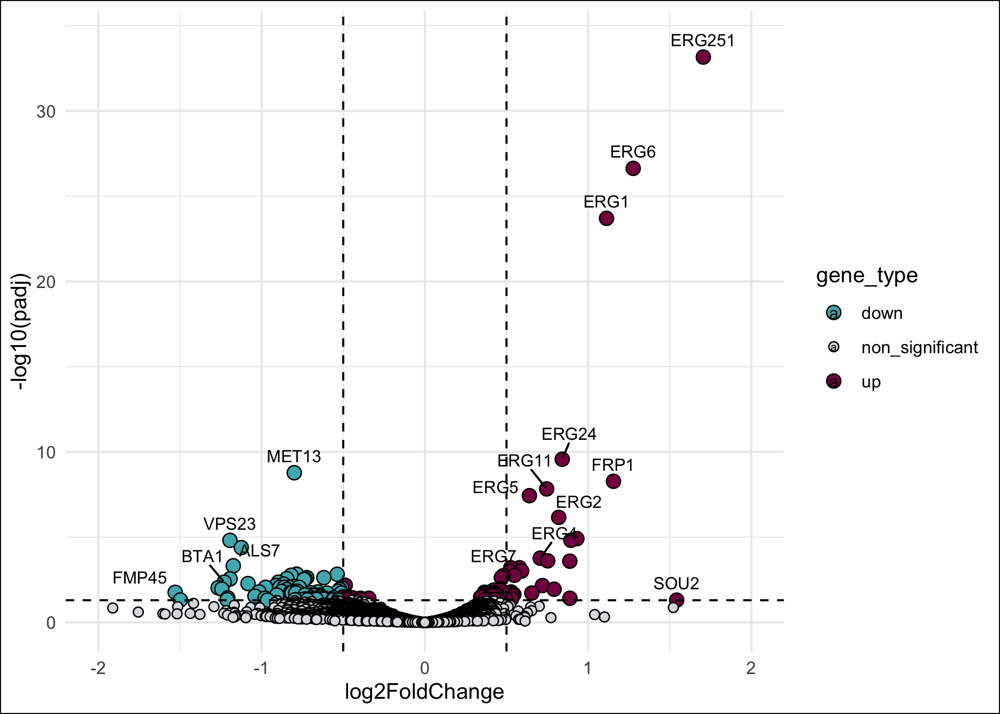
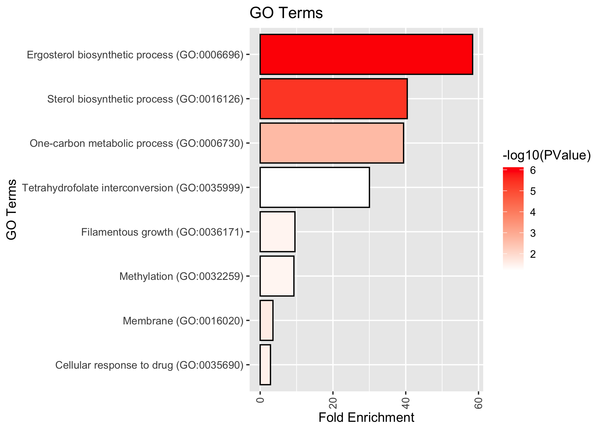

## Figure 2

Irene Stevens 23/05/2023

## This script will generate Figure 2

## Load Libraries

``` r
library(ggplot2)
library(ggrepel)
library(dplyr)
```

    ## 
    ## Attaching package: 'dplyr'

    ## The following objects are masked from 'package:stats':
    ## 
    ##     filter, lag

    ## The following objects are masked from 'package:base':
    ## 
    ##     intersect, setdiff, setequal, union

## Load Differentially Expressed Genes

See the DeSeq analysis section for how this input file was generated

``` r
ctx<-read.delim('/Users/vip/Documents/CUG_reprocessed/Figure 2/DEG_alpha.5_sc5314.txt', sep="\t", header=T)
```

## Create volcano plot

``` r
# set log2FoldChange=0.5

ctx <- ctx %>% mutate(gene_type = case_when(log2FoldChange >= 1 & padj <= 0.05 ~ "up",log2FoldChange <= 0.5 & padj <= 0.05 ~ "down",TRUE ~ "non_significant"))
cols <- c("up" = "#ff4122", "down" = "#03254c", "non_significant" = "grey")  
sizes <- c("up" = 2, "down" = 2, "non_significant" = 1) 
alphas <- c("up" = 1, "down" = 1, "non_significant" = 0.5)

ctx %>% ggplot(aes(x = log2FoldChange,y = -log10(padj),fill = gene_type,size = gene_type,alpha = gene_type)) + geom_point(shape = 21, colour = "black") + geom_hline(yintercept = -log10(0.05),linetype = "dashed") + geom_vline(xintercept = c(-0.5,0.5),linetype ="dashed") + scale_fill_manual(values = cols) + scale_size_manual(values = sizes) +scale_alpha_manual(values = alphas)+scale_x_continuous(breaks = c(seq(-3, 3, 2)),    limits = c(-8, 8))  + geom_text_repel(data = ctx %>% filter(gene_id %in% c("ERG251", "ERG6", "ERG25", "ERG1", "SET3", "ERG3","ERG11","ERG10","CAALFM_C405440CA","SAH1","ERG2","ERG5","ERG27","PMC1","MET13","YWP1","CAALFM_C604240WA")),aes(label = gene_id),force = 2,nudge_y = 1) +scale_colour_manual(values = cols) + scale_x_continuous(breaks = c(seq(-2, 2, 1)), limits = c(-2, 2))
```

    ## Scale for x is already present.
    ## Adding another scale for x, which will replace the existing scale.

    ## Warning: Removed 3139 rows containing missing values (`geom_point()`).

    ## Warning: Removed 1 rows containing missing values (`geom_text_repel()`).



## Plot GO terms downloaded from DAVID

Load DAVID enriched terms (see Suplementary Table S4)

``` r
data<-read.delim('/Users/vip/Documents/CUG_reprocessed/Figure 2/GO_data.txt', header=T)
```

Barplot of enriched GO Terms

``` r
data <- data[order(-data$Fold.Enrichment), ]

ggplot(data, aes(x = reorder(Term, Fold.Enrichment), y = Fold.Enrichment, fill=-log10(PValue)))+ coord_flip() +  geom_bar(stat = "identity", color = "black") + scale_fill_gradient(low = "white", high = "red") + theme(axis.text.x = element_text(angle = 90, hjust = 1, vjust = 0.5)) + labs(x = "GO Terms", y = "Fold Enrichment", title = "GO Terms")
```


