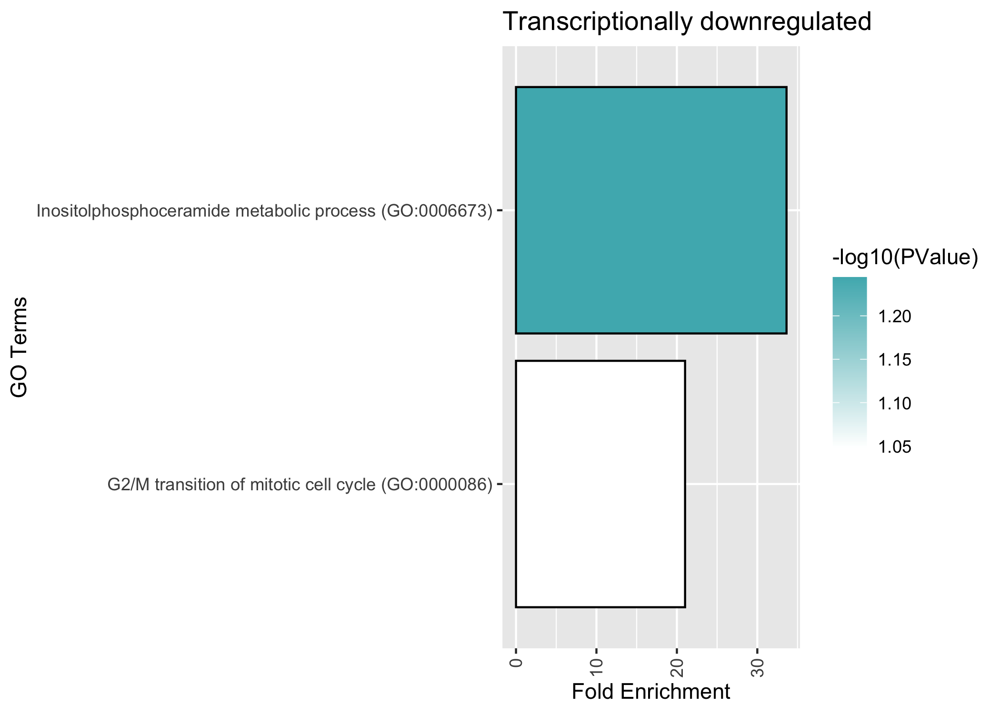

## Figure 2

Irene Stevens

23/05/2023

## This script will generate Figure 2

## Load libraries

``` r
library(ggplot2)
library(ggrepel)
library(dplyr)
```

    ## 
    ## Attaching package: 'dplyr'

    ## The following objects are masked from 'package:stats':
    ## 
    ##     filter, lag

    ## The following objects are masked from 'package:base':
    ## 
    ##     intersect, setdiff, setequal, union

``` r
library(gridExtra)
```

    ## 
    ## Attaching package: 'gridExtra'

    ## The following object is masked from 'package:dplyr':
    ## 
    ##     combine

``` r
library(reshape2)
```

## Load Differentially Expressed Genes

See the DeSeq analysis section for how this input file was generated

``` r
ctx<-read.delim('/Users/vip/Documents/Candida/RNA-seq/DEG_sc5314_geneid.txt', sep="\t", header=T)
```

## Create volcano plot

Note: here I set log2FoldChange=0.5

``` r
ctx <- ctx %>% mutate(gene_type = case_when(log2FoldChange >= -0.5 & padj <= 0.05 ~ "up",log2FoldChange <= 0.5 & padj <= 0.05 ~ "down",TRUE ~ "non_significant"))
cols <- c("up" = "#870052", "down" = "#4DB5BC", "non_significant" = "#DDDEE0")
sizes <- c("up" = 3, "down" = 3, "non_significant" = 2)
alphas <- c("up" = 3, "down" = 3, "non_significant" = 2)

volcano<- ctx %>%
  ggplot(aes(x = log2FoldChange, y = -log10(padj), fill = gene_type, size = gene_type, alpha = gene_type)) +
  geom_point(shape = 21, colour = "black") +
  geom_hline(yintercept = -log10(0.05), linetype = "dashed") +
  geom_vline(xintercept = c(-0.5, 0.5), linetype = "dashed") +
  scale_fill_manual(values = cols) +
  scale_size_manual(values = sizes) +
  scale_alpha_manual(values = alphas) +
  scale_x_continuous(breaks = c(seq(-3, 3, 2)), limits = c(-8, 8)) +
  geom_text_repel(
    data = ctx %>%
      filter(gene_id %in% c("ERG251", "ERG6", "ERG1", "ERG24", "MET13", "FRP1", "ERG11", "VPS23", "ERG2", "ERG5", "ERG4", "FMP45", "BTA1", "ERG7", "ALS7", "SOU2")),
    aes(label = gene_id),
    force = 2,
    nudge_y = 1
  ) +
  scale_colour_manual(values = cols) +
  scale_x_continuous(breaks = c(seq(-2, 2, 1)), limits = c(-2, 2)) +
  theme_minimal() +  # Set the plot theme to minimal
  theme(plot.background = element_rect(fill = "white"))  # Change the background color to white
```

    ## Scale for x is already present.
    ## Adding another scale for x, which will replace the existing scale.

``` r
volcano
```

    ## Warning: Removed 147 rows containing missing values (`geom_point()`).


## Plot Gene Ontology Terms downloaded from DAVID

Load DAVID enriched terms (see Suplementary Table S4)

``` r
data_up <- read.delim('/Users/vip/Documents/Candida/RNA-seq/GO_sc5314_up_genes.txt', header = TRUE)
data_up <- data_up[order(-data_up$Fold.Enrichment), ]

data_down <- read.delim('/Users/vip/Documents/Candida/RNA-seq/GO_sc5314_down_genes.txt', header = TRUE)
data_down <- data_down[order(-data_down$Fold.Enrichment), ]
```

Barplot of Enriched GO Terms in transcriptionally upregulated genes

``` r
plot_up <- ggplot(data_up, aes(x = reorder(Term, Fold.Enrichment), y = Fold.Enrichment, fill=-log10(PValue))) + 
  coord_flip() +   
  geom_bar(stat = "identity", color = "black") +  
  scale_fill_gradient(low = "white", high = "#870052") +
  theme(axis.text.x = element_text(angle = 90, hjust = 1, vjust = 0.5)) + 
  labs(x = "GO Terms", y = "Fold Enrichment", title = "Transcriptionally upregulated")

plot_up
```


Barplot of Enriched GO Terms in transcriptionally downregulated genes

``` r
plot_down <- ggplot(data_down, aes(x = reorder(Term, Fold.Enrichment), y = Fold.Enrichment, fill=-log10(PValue))) + 
  coord_flip() +   
  geom_bar(stat = "identity", color = "black") +  
  scale_fill_gradient(low = "white", high = "#4DB5BC") +  
  theme(axis.text.x = element_text(angle = 90, hjust = 1, vjust = 0.5)) +  
  labs(x = "GO Terms", y = "Fold Enrichment", title = "Transcriptionally downregulated")

plot_down
```


